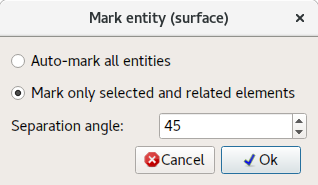

# Mark surface

Boundary, initial and environment conditions can be applied only on entities (Points, Lines, Surfaces and Volumes), therefore it is necessary to split one surface into multiple logical surfaces. This process is called **marking**.

## Auto-mark all entities

All surface elements will be inspected and grouped to surface entities based on **segregation angle**.

## Mark only selected and related elements

All surface elements neighboring with selected (picked) elements (including) will be inspected and grouped to surface entity based on **segregation angle**.
