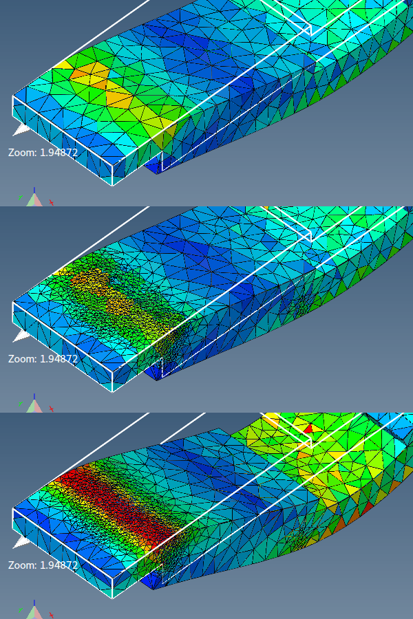

# Generate tetrahedral mesh

Generate volume (tetrahedral) mesh.

**Volume mesh** is required for most **problem types**.

3D mesh generator can generate mesh only if:
1. Model contains enclosed (watertight) surface.
2. Surface elements do not intersect each other.

To generate multiple volume meshes to represent composite material model a separation surface must be included.

In some cases there might be a need for overriding default settings and specify TetGen parameters directly.

## GUI

- **Check surface integrity** - useful when generating a 3D mesh from surface model. It can detect surface mesh errors and potential problems.
- **Reconstruct mesh (reuse current nodes)** - keep current nodes and only add new ones if needed.
- **Keep computed results** - all computed results will be mapped/interpolated to new nodes and elements.
- **Quality mesh** - generate 3D mesh to conform with quality criteria.
    - **Maximum element volume** - maximum volume of each generated element. No element should have higher volume then specified.
    - **Generate mesh size function** - should be used to refine mesh in places where differences in results are found.
- **TetGen parameters** - parameters passed to TetGen mesh generator.

Following picture shows difference on mesh resolution when adaptive meshing is used.

## Parameters syntax

`pYrq_Aa_miO_S_T_XMwcdzfenvgkJBNEFICQVh`

Underscores indicate that numbers may optionally follow certain switches. Do not leave any space between a switch and its numeric parameter.

An overview of all command line switches and a short description follow.

- **p** - Tetrahedralizes a piecewise linear complex (PLC).
- **r** - Reconstructs a previously generated mesh.
- **q** - Refines mesh (to improve mesh quality).
- **R** - Mesh coarsening (to reduce the mesh elements).
- **a** - Applies a maximum tetrahedron volume constraint.
- **O** - Specifies the level of mesh optimization.
- **S** - Specifies maximum number of added points.
- **T** - Sets a tolerance for coplanar test (default 10−8).
- **X** - Suppresses use of exact arithmetic.
- **M** - No merge of coplanar facets or very close vertices.
- **w** - Generates weighted Delaunay (regular) triangulation.
- **c** - Retains the convex hull of the PLC.
- **d** - Detects self-intersections of facets of the PLC.
- **n** - Outputs tetrahedra neighbors.
- **C** - Checks the consistency of the final mesh.
- **Q** - Quiet: No terminal output except errors.
- **V** - Verbose: Detailed information, more terminal output.
