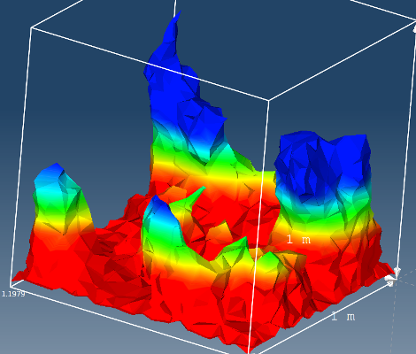

# Create ISO

**ISO entity** is a form of an interpolated entity similar to **Cut**. **ISO entity** is a 'layer surface' based on a scalar value or magnitude of a vector.

**ISO entity** can be created on any volume or surface entity from any result variable which is applicable on nodes. **Result variables** which are by default applicable on elements such as **Von Mises Stress** must be converted to node variables first.

