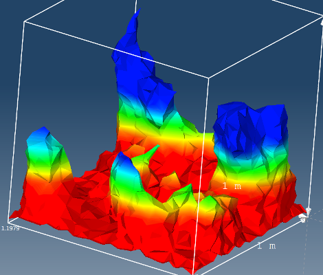

# Vytvoriť ISO

**ISO entita** je forma interpolovanej entity podobná **Rezu**. **ISO entita** je „vrstvová plocha" na základe skalárnej hodnoty alebo veľkosti vektora.

**ISO entitu** možno vytvoriť na akejkoľvek objemovej alebo plošnej entite z akejkoľvek výsledkovej premennej aplikovateľnej na uzly. **Výsledkové premenné**, ktoré sú štandardne aplikovateľné na prvky, ako napríklad **Von Misesovo napätie**, musia byť najprv prevedené na uzlové premenné.

