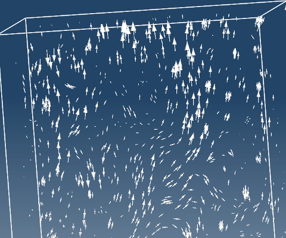
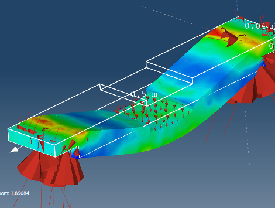

# Create vector field

**Vector field**:

- Helps to visualize fields such as velocity, electric and magnetic field, heat flow and forces.
- Can be created on any model entity or interpolated surface such as **Cuts** and **ISO surfaces**.

