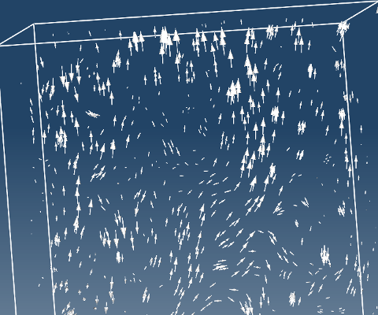
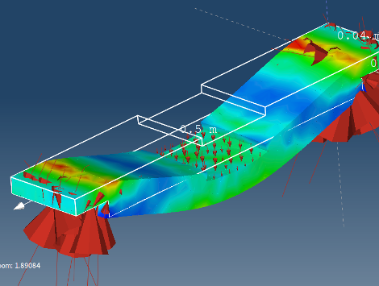

# Vytvoriť vektorové pole

**Vektorové pole**:

- Pomáha vizualizovať polia, ako sú rýchlosť, elektrické a magnetické pole, tepelný tok a sily.
- Možno ho vytvoriť na akejkoľvek entite modelu alebo interpolovanej ploche, ako sú **Rezy** a **ISO plochy**.

