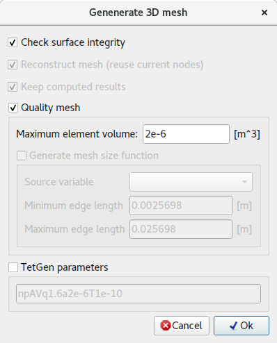
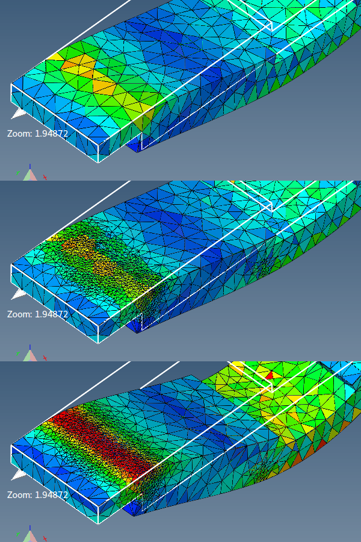

# Generovať tetraedrálnu sieť

Generuje objemovú (tetraedrálnu) sieť.

**Objemová sieť** je potrebná pre väčšinu **typov problémov**.

Generátor 3D siete môže generovať sieť iba ak:
1. Model obsahuje uzavretú (nepriepustnú) plochu.
2. Povrchové prvky sa navzájom nepretínajú.

Na generovanie viacerých objemových sietí reprezentujúcich model s kompozitným materiálom musí byť zahrnutá oddeľovacia plocha.

V niektorých prípadoch môže byť potrebné prepísať predvolené nastavenia a zadať parametre TetGenu priamo.

## Rozhranie

- **Skontrolovať integritu plochy** – užitočné pri generovaní 3D siete z povrchového modelu. Dokáže detekovať chyby povrchovej siete a potenciálne problémy.
- **Rekonštruovať sieť (zachovať aktuálne uzly)** – zachová aktuálne uzly a pridá nové iba v prípade potreby.
- **Zachovať vypočítané výsledky** – všetky vypočítané výsledky budú namapované/interpolované na nové uzly a prvky.
- **Kvalitná sieť** – generuje 3D sieť podľa kritérií kvality.
    - **Maximálny objem prvku** – maximálny objem každého vygenerovaného prvku. Žiadny prvok by nemal mať väčší objem, ako je zadaný.
    - **Generovať funkciu veľkosti siete** – malo by sa použiť na zjemnenie siete na miestach, kde sú zistené rozdiely vo výsledkoch.
- **Parametre TetGenu** – parametre odovzdávané generátoru siete TetGen.

Nasledujúci obrázok zobrazuje rozdiel v rozlíšení siete pri použití adaptívneho sieťovania.

## Syntax parametrov

`pYrq_Aa_miO_S_T_XMwcdzfenvgkJBNEFICQVh`

Podčiarkovníky naznačujú, že po určitých prepínačoch môžu voliteľne nasledovať čísla. Nenechávajte žiadnu medzeru medzi prepínačom a jeho číselným parametrom.

Prehľad všetkých prepínačov príkazového riadka s krátkym popisom:

- **p** – Tetrahedrizuje po častiach lineárny komplex (PLC).
- **r** – Rekonštruuje predtým vygenerovanú sieť.
- **q** – Zjemní sieť (na zlepšenie kvality siete).
- **R** – Zhrubenie siete (na zníženie počtu prvkov siete).
- **a** – Aplikuje obmedzenie maximálneho objemu tetraedra.
- **O** – Určuje úroveň optimalizácie siete.
- **S** – Určuje maximálny počet pridaných bodov.
- **T** – Nastavuje toleranciu pre test koplanarity (predvolene 10−8).
- **X** – Potláča použitie presnej aritmetiky.
- **M** – Žiadne zlúčenie koplanárnych stien ani veľmi blízkych vrcholov.
- **w** – Generuje váženú Delaunayovu (pravidelnú) trianguláciu.
- **c** – Zachová konvexný obal PLC.
- **d** – Detekuje vlastné priesečníky stien PLC.
- **n** – Vypisuje susedov tetraedrov.
- **C** – Kontroluje konzistentnosť výslednej siete.
- **Q** – Tichý režim: Žiadny výstup do terminálu okrem chýb.
- **V** – Podrobný režim: Detailné informácie, viac výstupu do terminálu.
