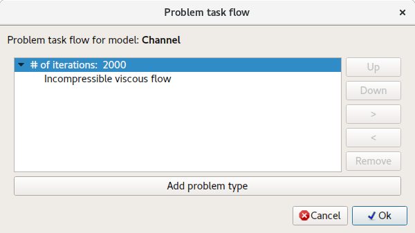
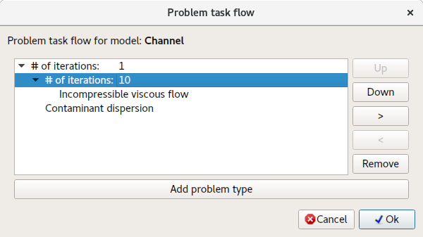
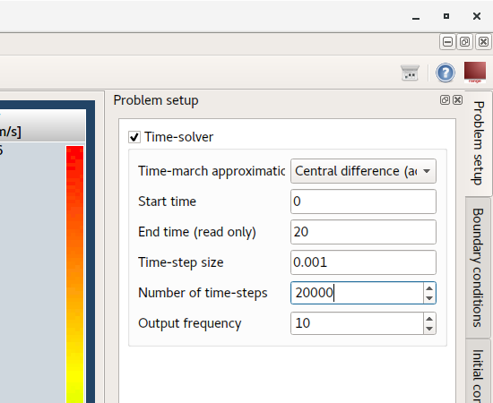
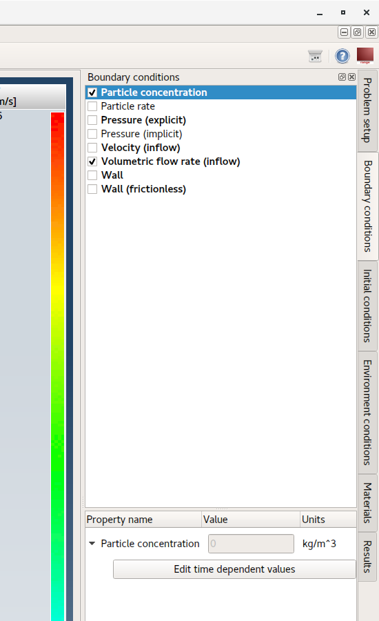
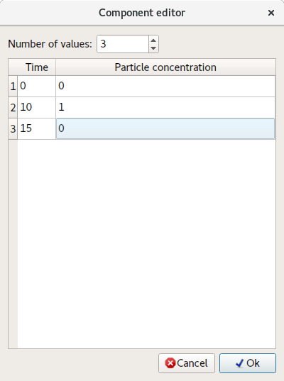
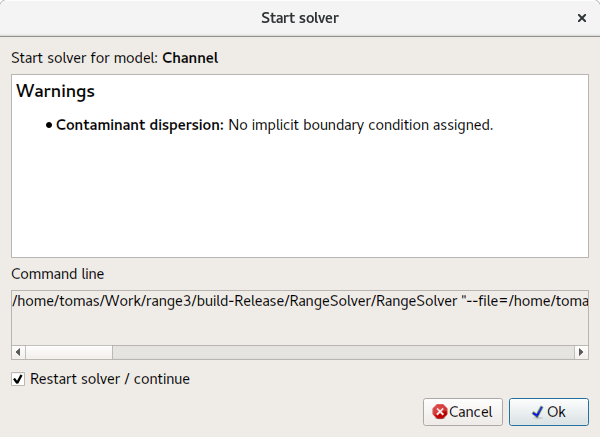
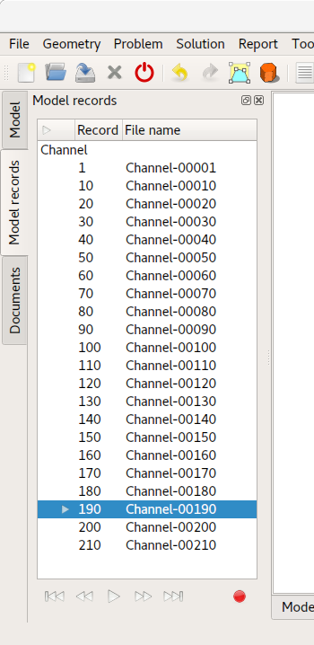
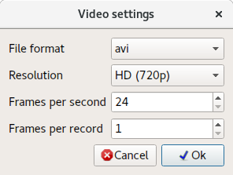
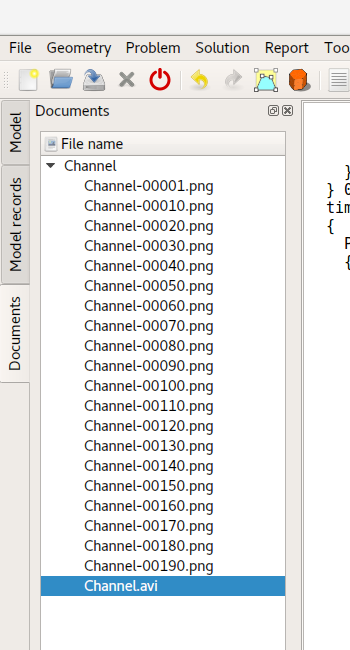

# Contaminant dispersion in fluids

This tutorial will demonstrate how to setup advanced multi physics simulation including non-linear iterative problem such as **CFD (Computational Fluid Dynamics)**.

To solve **contaminant dispersion in fluid** following problem types need to be configured:

1. **Contaminant dispersion** - Calculate distribution of contaminant in the flow field.
2. **Inconpressible viscous flow** - Stead-state and transient flow of newtonian fluids.

Since **CFD** is a nonlinear problem it requires iterative solution. This problem will be solved in two steps:

1. **Steady-state** - First it is necessary to get "initial" flow field and pressure distribution.
2. **Transient** - In second step a **time marching** will be used to get transient solution.

## 1. Load model

Load model **Channel.tmsh**.

## 2. Problem task flow (Step 1)

First a converged initial flow is needed. For this reason steady-state solution of the incompressible viscous flow is needed. In **Problem task flow** dialog select appropriate problem type and set **# of iterations:** to **2000**. To do so double click on the initial value.

## 3. Generate 3D mesh

To solve this problem volume mesh must be generated.

**Menu:** _Geometry -> Volume -> Generate tetrahedral mesh_

## 4. Assign material

Assign **Water** to all model entities.

## 5. Boundary conditions

Assign following boundary conditions to **surface** entities as described below.

1. **Walls**
    - _Wall_
        - N/A
2. **Inflow**
    - _Volumetric flow rate (inflow)_
        - Volumetric flow rate = 50 `[m^3/sN/A]`
3. **Outflow**
    - _Pressure (implicit)_
        - Pressure = 0 `[Pa]`

## 6. Solve problem

Do the same as in the previous tutorials.

It will take some time until solver computes all iterations and find converged solution. Solver convergence can be checked using following action:

**Menu:** _Report -> Solver convergence_

## 7. Problem task flow (Step 2)

Once the solver converges **transient** problem including **Contaminant dispersion** can be configured.

Since **Inconpressible viscous flow** is nonlinear problem it will always need some nonlinear iterations to be specified to find converged solution for each time-step. **Task flow** should look-like as shown on the screenshot below.

## 8. Time solver setup

Click on **Problem setup** tab. Enable **Time-solver** and specify values as shown on the screenshot below.

## 9. Boundary conditions

Apply **Particle concentration** boundary condition to **Inflow** model entity.

Do not specify value but click on **Edit time dependent values** button, to specify time-triggered (time-profile) boundary condition.

In the **Component editor** dialog time depended values can be specify. Values are always valid **from** specified time.

## 10. Solve problem (restart)

Once the problem is fully configured restart the solver. This is done just like when starting a solver but **Restart solver / continue** check-box must be selected. This will make the solver to use already computed results as a starting point and continue in time-marching simulation.

## 11. Model records (results in time)

As the solver keeps finding solutions for each time-step, model records are being written. Each record contains solution for given time-step. List of these records can be seen in **Model records** tree. By double-clicking on the record results for given time-step will be loaded.

## 12. Record video

To record a video from computed results go to **Model records** tree and click on the **Record** button (Red point at the bottom).

After clicking on **Record** button **Video settings** dialog will appear. Click **Ok** to start video recording process.

To create a video can take some time since video frames are created from screenshots of **3D model area** and for each model record must be loaded.

All produced screenshots and video itself can be found in **Documents** tree. To view the video double-click on its name **Channel.avi**.

