# Contaminant dispersion in fluids

This tutorial will demonstrate how to set up an advanced multi-physics simulation including a non-linear iterative problem such as **CFD (Computational Fluid Dynamics)**.

To solve **contaminant dispersion in fluid**, the following problem types need to be configured:

1. **Contaminant dispersion** - Calculate distribution of contaminant in the flow field.
2. **Incompressible viscous flow** - Steady-state and transient flow of Newtonian fluids.

Since **CFD** is a nonlinear problem it requires iterative solution. This problem will be solved in two steps:

1. **Steady-state** - First it is necessary to get an "initial" flow field and pressure distribution.
2. **Transient** - In the second step, **time marching** will be used to get a transient solution.

## 1. Load model

Load model **Channel.tmsh**.

**Menu:** _File -> Open model_

## 2. Problem task flow (Step 1)

First a converged initial flow is needed. For this reason steady-state solution of the incompressible viscous flow is needed. In **Problem task flow** dialog, which pops up after the model is loaded, click **Add problem type**, check **Incompressible viscous flow** and click **OK**. Then set **# of iterations:** to **2000**. To do so double click on the initial value, type the new value and press _Enter_. Click **OK** to close the dialog.

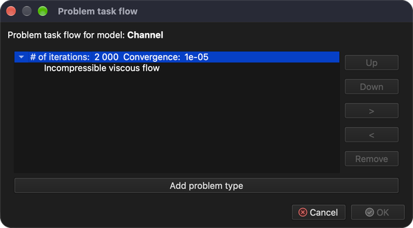

## 3. Generate 3D mesh

To solve this problem, a volume mesh must be generated.

**Menu:** _Geometry -> Volume -> Generate tetrahedral mesh_

The prefilled values in the **Generate 3D mesh** dialog are sufficient. Click **OK** button to accept.

## 4. Assign material

Select all model entities in the **Model tree** and assign **Water** in the **Material** tab.

## 5. Boundary conditions

Assign following boundary conditions to **surface** entities in the **Boundary conditions** tab as described below.

1. **Walls**
    - _Wall_
        - N/A
2. **Inflow**
    - _Volumetric flow rate (inflow)_
        - Volumetric flow rate = 50 `[m^3/s]`
3. **Outflow**
    - _Pressure (implicit)_
        - Pressure = 0 `[Pa]` (default value is 1000 `[Pa]`)

## 6. Solve problem

Do the same as in the previous tutorials.

**Menu:** _Solution -> Start solver_

If the model has not been saved yet, a **Save model** dialog will be shown first. Click **Save** to accept and then click **OK** in the **Start solver** dialog.

It will take some time until the solver computes all iterations and finds a converged solution. Solver convergence can be checked using the following action:

**Menu:** _Report -> Solver convergence_

## 7. Create a cut

A good way to inspect a flow is to display the velocity as a **vector field**, where every arrow shows the direction and magnitude of the flow at one point. A vector field drawn through the whole volume, however, quickly becomes a dense cloud of overlapping arrows that is hard to read. It is usually clearer to first slice the model with a **cut** - a plane through the volume - and then display the vector field only on that plane.

**Menu:** _Geometry -> Cut -> Create cut_

In the **Cut editor** dialog:

1. Select **Volume 1** in the **Model** tree. The cut will be created through this volume.
2. Use **Plane position** to set a point the cut plane passes through. The default values place it in the center of the model (**X** = 7.5, **Y** = 2.5, **Z** = 1.5 `[m]`).
3. Use **Plane normal** to set the orientation of the plane. The normal (**X** = 0, **Y** = 0, **Z** = 1) gives a horizontal plane cutting through the mid-height of the channel.

The cut plane is previewed in the **3D model area** while the values are being changed. Click **OK** to create the cut. A new entity **Cut 1** appears in the **Model tree** under **Cuts**.

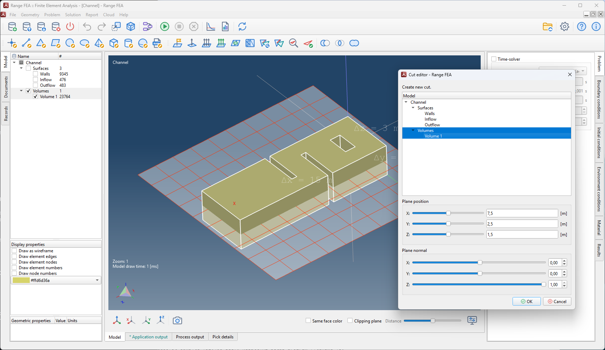

## 8. Create a vector field

Now display the computed velocity as arrows on the cut plane.

**Menu:** _Geometry -> Vector field -> Create vector field_

In the **Vector field editor** dialog:

1. Select **Cut 1** in the **Model** tree. The arrows will be drawn on the cut plane created in the previous step.
2. Select **Velocity** in the **Variables** list.
3. Leave **3D vector field** checked. The arrows then show the full velocity vector. When unchecked, each arrow is projected onto the cut plane and only the in-plane part of the flow is shown.

Click **OK** to create the vector field.

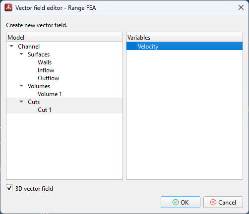

The arrows may be too short to be clearly visible, because their length is proportional to the flow velocity. To make them longer, open the **Results** tab, select the **Velocity - Vector** variable and increase the value in the **Scale** section. The scale is the product of the **Scale** value and the power of ten set in **Factor**; in the example below **Scale** 1 and **Factor** 2 give a scale of `1 × 10^2 = 100`.

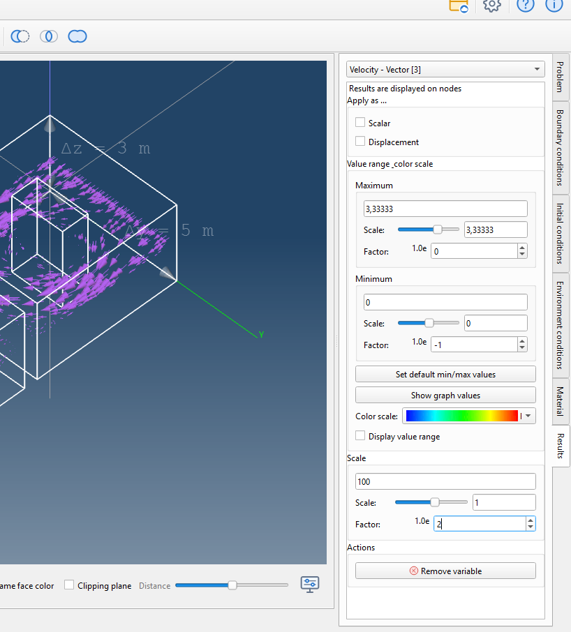

## 9. Problem task flow (Step 2)

Once the solver converges, a **transient** problem including **Contaminant dispersion** can be configured.

Since **Incompressible viscous flow** is a nonlinear problem, it will always need some nonlinear iterations to be specified to find a converged solution for each time-step. Open the **Problem task flow** dialog again (toolbar button **Problem(s) task flow**) and set it up as follows:

1. Select **Incompressible viscous flow** and click the **>** button. This will nest it into a new iteration group.
2. Set the outer **# of iterations:** to **1** and the inner (nested) **# of iterations:** to **10**.
3. Click **Add problem type**, check **Contaminant dispersion** and click **OK**. If a second **Incompressible viscous flow** entry is added at the outer level, select it and click **Remove**.

**Task flow** should look like as shown in the screenshot below. Click **OK** to accept.

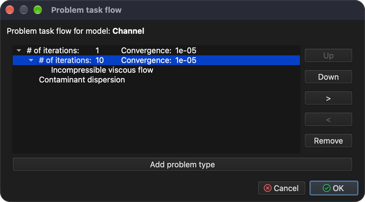

## 10. Time solver setup

Click on **Problem** tab. Enable **Time-solver** and specify values as shown on the screenshot below (**Time-step size** 0.01, **Number of time-steps** 2000, **Output frequency** 10; **End time** is computed automatically).

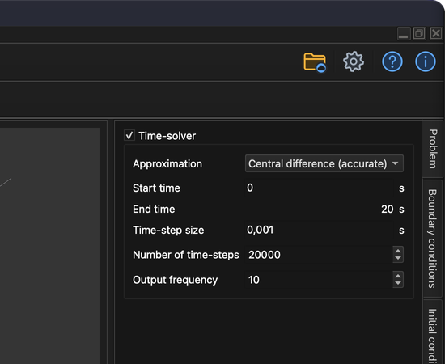

## 11. Boundary conditions

Apply **Particle concentration** boundary condition to **Inflow** model entity.

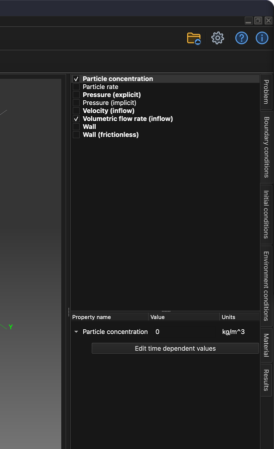

Do not specify value but expand the **Particle concentration** property (arrow in front of its name) and click on **Edit time dependent values** button, to specify time-triggered (time-profile) boundary condition.

In the **Component editor** dialog, time-dependent values can be specified. Values are always valid **from** the specified time. Set **Number of values** to **3** and enter values as shown below (double click on a cell to edit it), then click **Ok**.

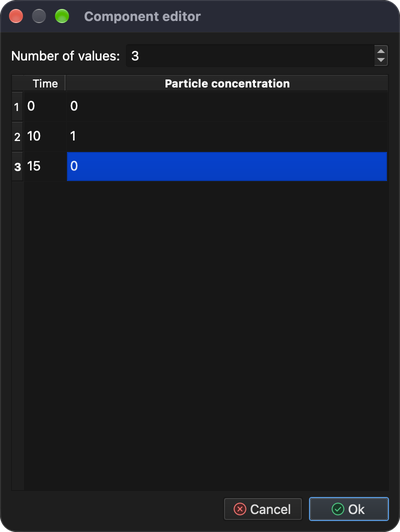

## 12. Solve problem (restart)

Once the problem is fully configured, restart the solver. This is done just like when starting a solver, but the **Restart solver / continue** check-box must be selected. A warning **Contaminant dispersion: No implicit boundary condition assigned.** is expected and can be ignored. This will cause the solver to use already computed results as a starting point and continue in the time-marching simulation.

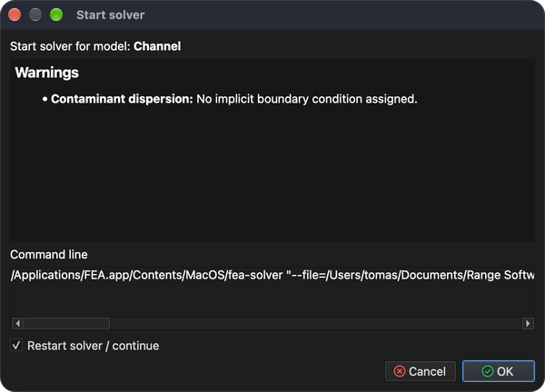

## 13. Model records (results in time)

As the solver keeps finding solutions for each time-step, model records are being written. Each record contains a solution for a given time-step. A list of these records can be seen in the **Records** tree. By double-clicking on a record, results for the given time-step will be loaded.

## 14. Record video

Computing all 20000 time-steps takes a long time. The solver can be stopped at any time (**Menu:** _Solution -> Stop solver_, confirm with **Yes**); already written records are kept.

To record a video from computed results go to **Records** tree and click on the **Record** button (Red point at the bottom). The range of records used for the video can be set with the **From** and **To** fields.

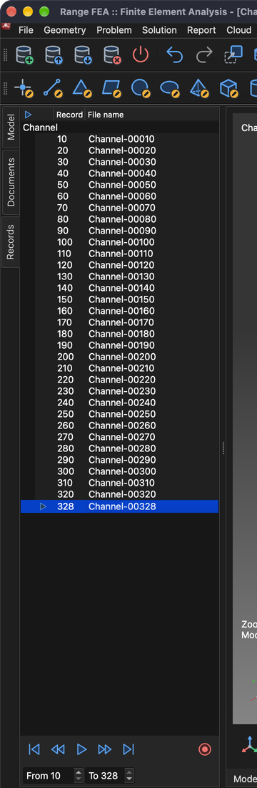

After clicking on **Record** button **Video settings** dialog will appear, where video codec, file format and frame rate can be set and the estimated video length is shown. Click **OK** to start video recording process.

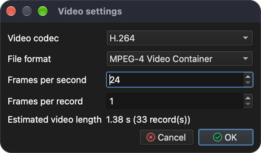

Creating a video can take some time since video frames are created from screenshots of the **3D model area** and each model record must be loaded.

All produced screenshots and video itself can be found in **Documents** tree. To view the video double-click on its name **Channel.mp4**.

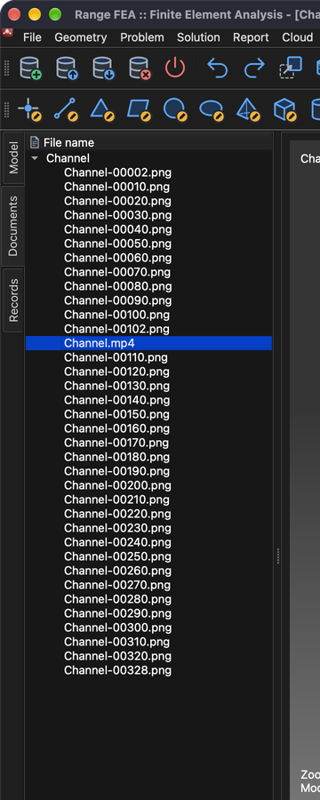

