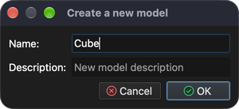
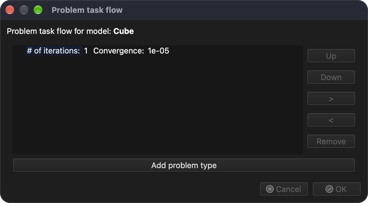
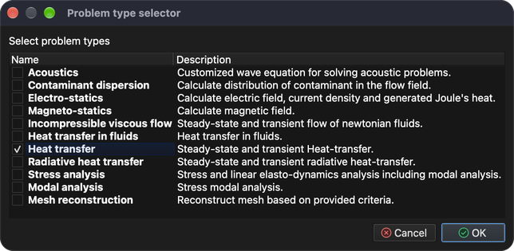
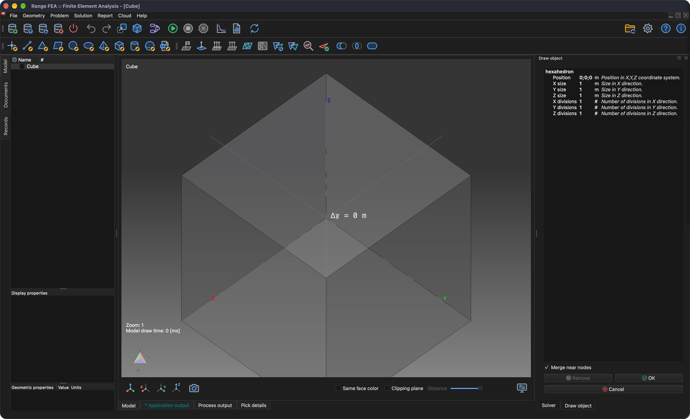
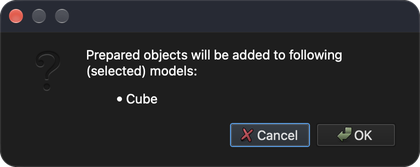

# Draw cube

This tutorial will show how to draw/generate a simple geometry such as cube.

## 1. Create a new model

**Menu:** _File -> New model_

Enter **Cube** as the model name and click **OK**. A new empty model named **Cube** will be created. Since the newly created model has no problem assigned, a **Problem task flow** dialog will pop up.

### 1.1 Assign problem type

To assign a problem type click on **Add problem type** button and in **Problem type selector** dialog select **Heat transfer**.

Click the **OK** button to close the **Problem type selector** dialog and then again the **OK** button to close the **Problem task flow** dialog.

## 2. Draw a cube

**Menu:** _Geometry -> Draw -> Draw hexahedron_

Once the menu item is activated, a **Draw object** panel will be shown on the right side of the main window where the user can change object position, size, and axial divisions.

Displayed object changes at the same time as values are being changed in the **Draw object** panel. Click the **OK** button to add the object to the model. A confirmation dialog listing the selected model(s) the object will be added to will pop up.

Click **OK** to confirm and the cube will be added to the **Cube** model.

## 3. Save model

To save model just execute following action.

**Menu:** _File -> Save model_

If the model has not been saved before, the program will show a **Save model** dialog offering a filename and path where to store it. Click **Save** to accept.
