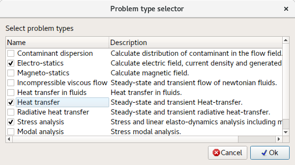
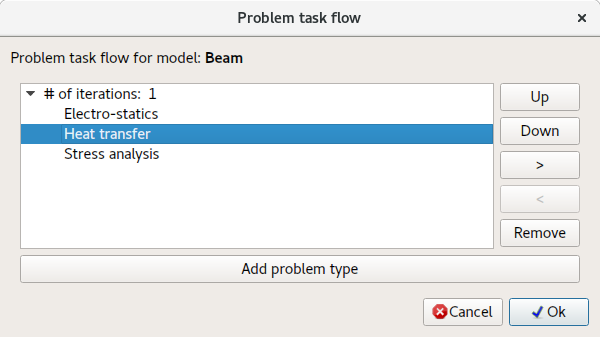
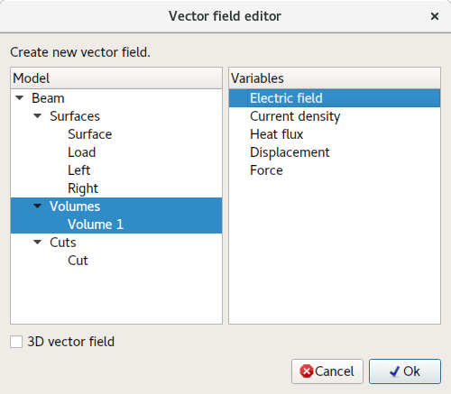
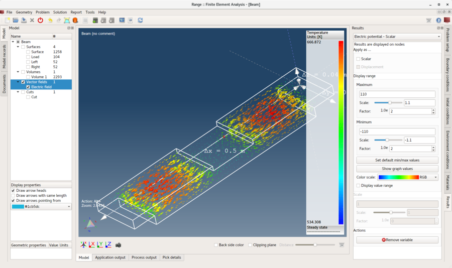
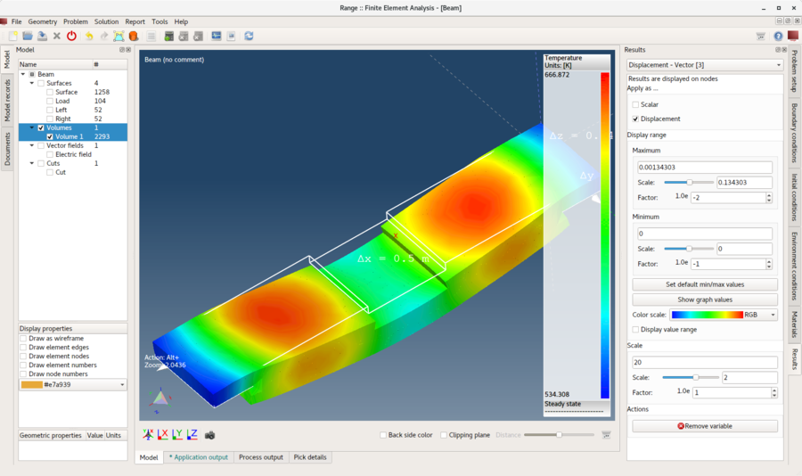

# Multi physics

In this tutorial solving multiple problems on one geometric model. For this purpose **Beam model** will be used through which a passing electric current will generate heat and deform a model.

Such engineering problem will require to setup three problem types:

1. **Electrostatics** - Calculate electric current and produced heat.
2. **Heat transfer** - Calculate temperature distribution.
3. **Stress analysis** - Calculate thermal expansion (displacements) and resulting stress.

## 1. Load model

Do the same as in the previous **Stress and deformation analysis** tutorial.

## 2. Problem task flow

The only difference to the process described in previous tutorial is to show how to create a **Problem task flow**. Everything else is done in the same way.

**Menu:** _Problem -> Problem(s) task flow_

In **Problem type selector** select all three problem types and click **Ok**.

Your **Problem task flow** now should look like as on the following picture. If order is not the same or there are more entries, **Up**, **Down** and **Remove** buttons can be used to modify the flow.

## 3. Assign material

Do the same as in the previous **Stress and deformation analysis** tutorial.

## 4. Assign boundary conditions

Because there are multiple problem types selected multiple boundary conditions can be assigned to each entity. Assign boundary conditions to **surface** entities as described below.

1. **Surface**
    - _Simple convection_
        - Convection coefficient = 100 `[W/(m^2*K)]`
        - Temperature = 293.15 `[K]`
2. **Load**
    - _Electric potential_
        - Electric potential = 110 `[V]`
    - _Simple convection_
        - Convection coefficient = 100 `[W/(m^2*K)]`
        - Temperature = 293.15 `K`
3. **Left** and **Right**
    - _Displacement_
        - Displacement in all directions = 0 `[m]`
    - _Electric potential_
        - Electric potential = -110 `[V]`
    - _Simple convection_
        - Convection coefficient = 100 `[W/(m^2*K)]`
        - Temperature = 293.15 `K`

## 5. Assign environment conditions

Assign following environment conditions to **all** model entities.

- _Gravitational acceleration_
    - Gravitational acceleration in X direction = 0 `[m/s^2]`
    - Gravitational acceleration in Y direction = 0 `[m/s^2]`
    - Gravitational acceleration in Z direction = -9.80665 `[m/s^2]`
- _Temperature_
    - Temperature = 293.15 `[K]`

## 6. Solve problem

Do the same as in the previous **Stress and deformation analysis** tutorial.

## 7. Create a vector field

**Vector field** is an entity which will be used to visualize electric field.

**Menu:** _Geometry -> Vector field -> Create vector field_

Select **volume** model entity and **Electric field** as shown on the picture below.

Click **Ok** button to create the **Vector field**. Once created it will be added to the **Model tree** and results variables can be applied to it as to any other model entity.

## 8. Apply results

Do the same as in the previous **Stress and deformation analysis** tutorial. Additionally you can apply results to created **Vector field** entity.

