# Stress and deformation analysis

This tutorial will demonstrate how to set up and solve a **Stress analysis** problem. For that reason a simple beam will be supported on both ends with a load in the middle.

## 1. Load model

**Menu:** _File -> Open model_

This will show an **Open model** dialog. Select file **Beam.tmsh** and click **Open** to load the model.

Since there is no physical problem assigned to this model, a **Problem task flow** dialog window will appear soon after loading of the model is complete.

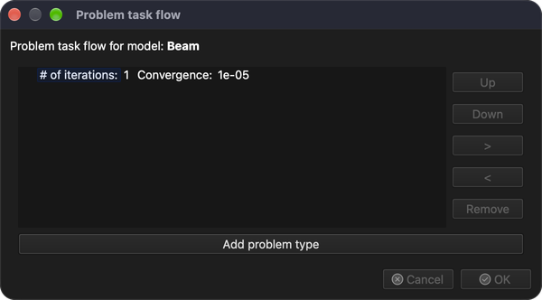

Click **Add problem type** button and **Problem type selector** dialog window will be displayed. Find and check **Stress analysis** and click **OK** button to accept.

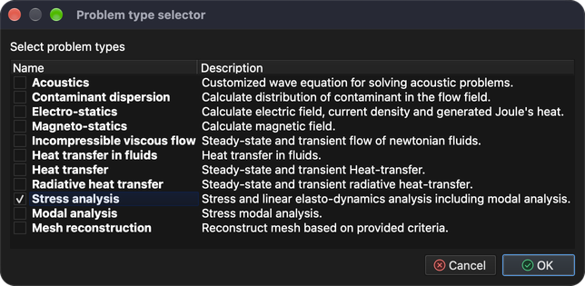

**Problem task flow** should now display 1 iteration of **Stress analysis**. Click **OK** to accept.

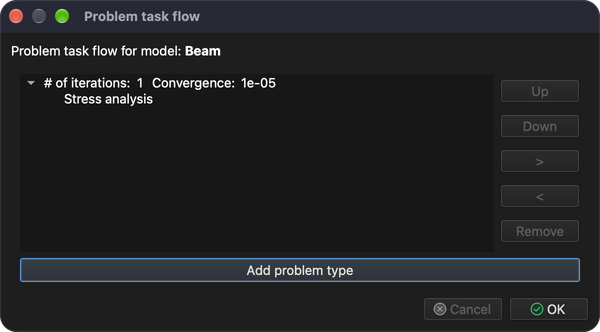

## 2. Generate 3D mesh

To solve this problem, a volume mesh must be generated.

**Menu:** _Geometry -> Volume -> Generate tetrahedral mesh_

This action will show the **Generate 3D mesh** dialog.

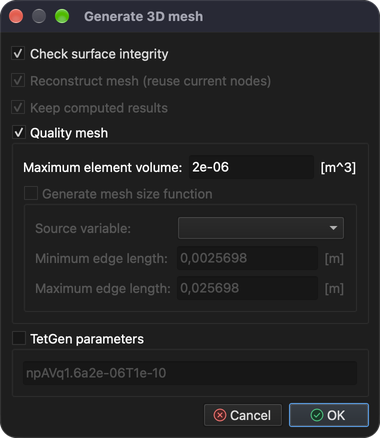

For now, the prefilled values are sufficient. Click **OK** button to accept.

Once the mesh is generated, a new **Volume** entity appears in the **Model tree**. To see the generated mesh, hide the surface entities, show only **Volumes** and check **Draw as wireframe** in **Display properties**.

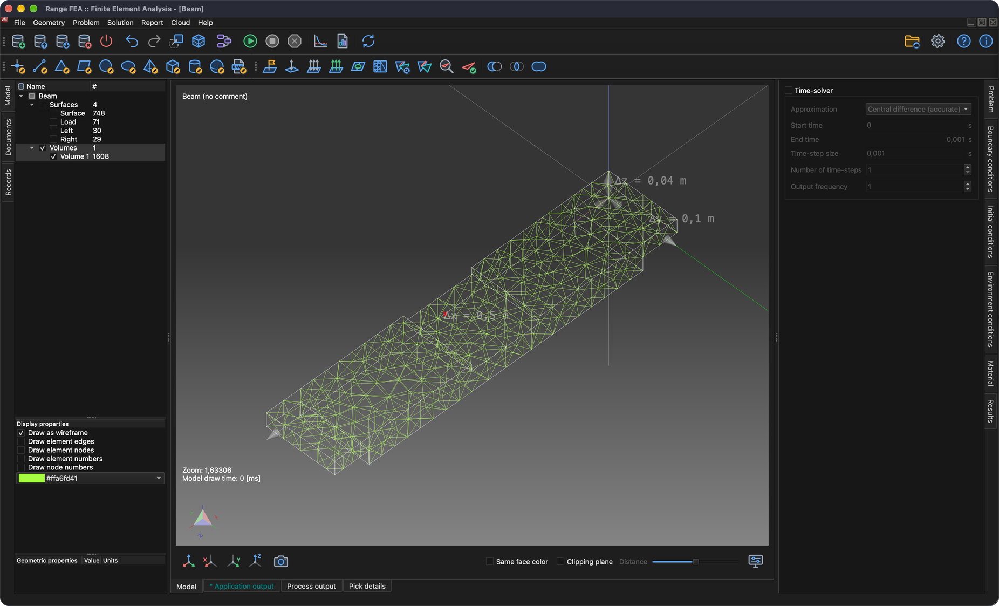

## 3. Assign material

Material can be assigned only to a selected model entity. Entities can be selected in the **Model tree**. To select multiple entities, hold down the _Ctrl_ key (_⌘ Cmd_ on macOS) while selecting entities, or hold down the _Shift_ key to select a range. Once all entities are selected, the material can be assigned in the **Material** tab on the right side of the main window.

**Model tree** and **material list** can be seen on screenshot below.

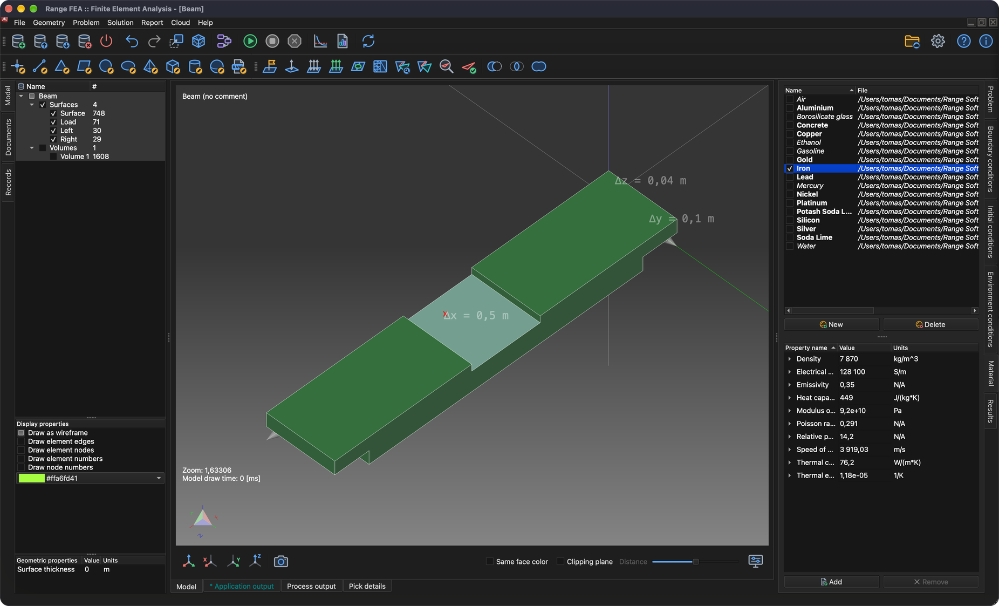

Material is assigned when check-box in front of the material name is checked. In this tutorial **Iron** is used.

_Note: All model entities must have material assigned._

## 4. Assign boundary conditions

The boundary conditions are the specified values of the field variables (or related variables such as derivatives) on the boundaries of the field. Boundary conditions can be divided into **Explicit** and **Implicit** conditions. **Explicit** conditions are highlighted with **strong** font.

In this tutorial boundary conditions will be applied to **surface** entities as described below:

1. **Load**
    - _Weight_
        - Weight = 1000 `[kg]`
2. **Left** and **Right**
    - _Displacement_
        - Displacement in X direction = 0 `[m]`
        - Displacement in Y direction = 0 `[m]`
        - Displacement in Z direction = 0 `[m]`

To apply **Weight** boundary condition follow these steps:

1. Select **Load** entity in the **Model tree**.
2. Open the **Boundary conditions** tab, then select and check **Weight** boundary condition.
3. Replace **1** with **1000** `[kg]` in value field for **Weight** property.

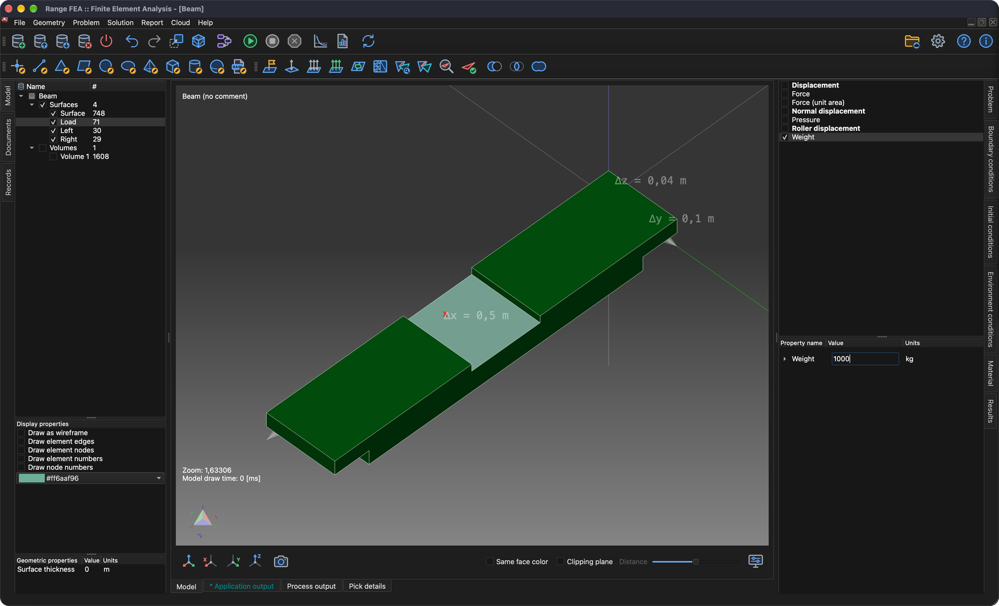

To apply **Displacement** boundary condition follow these steps:

1. Select **Left** and **Right** entities in the **Model tree** (hold down _Ctrl_ / _⌘ Cmd_ to select both).
2. Select and check **Displacement** boundary condition in the **Boundary conditions** tab.
3. Verify that all property values are set to **0** `[m]`.

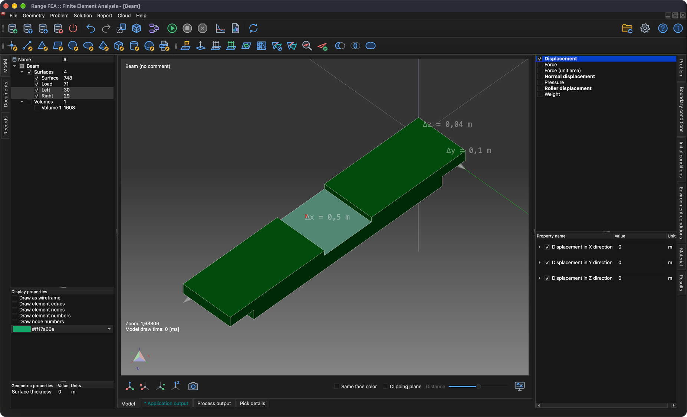

## 5. Assign environment conditions

For **Weight** boundary condition to work properly correct **Gravitational acceleration** environment condition must be assigned.

Environment conditions are not checked like boundary conditions. Open the **Environment conditions** tab and select **Gravitational acceleration** to verify its values: 0, 0 and -9.80665 `[m/s^2]` in X, Y and Z direction.

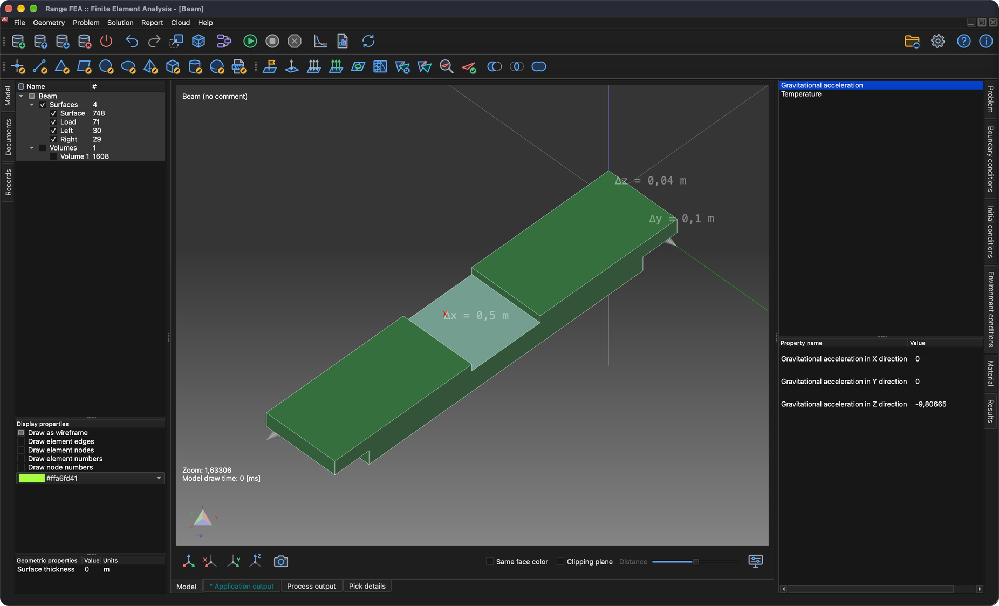

## 6. Solve problem

Once the problem is correctly configured it can be solved.

**Menu:** _Solution -> Start solver_

The model must be saved before the solver can start. If it has not been saved yet, a **Save model** dialog will be shown first; click **Save** to accept (if a file with the same name already exists, confirm replacing it). Then the **Start solver** dialog will be shown.

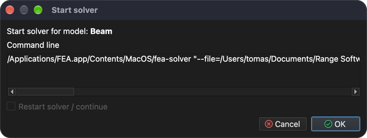

Click **OK** button to start the solver process.

Solver process is running in the background and all its output is displayed in the **Process output** tab as it can be seen on the screenshot below.
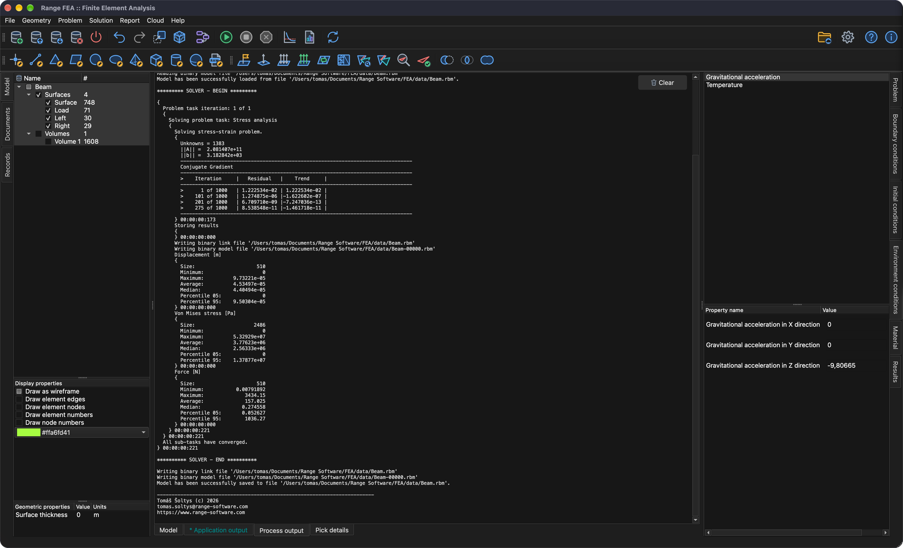

## 7. Apply computed results

After the solver process is successfully completed computed results should be loaded automatically. To display these results they need to be applied on model entities. This is done in the **Results** tab. Results are applied to the selected model entities. For this purpose hide all surface entities and show only **Volumes**.

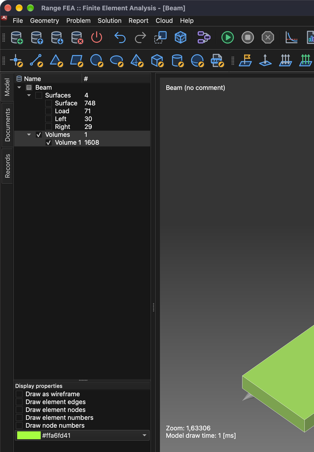

### 7.1. Displacement

From drop-down menu select **Displacement** (if not already selected). **Displacement** is a vector variable; it can be applied as a **Scalar** (entity will be colored by its magnitude) and/or as a **Displacement** (entity will bend). This time select the **Displacement** check-box and set **Scale** to **500** to see the deformation.

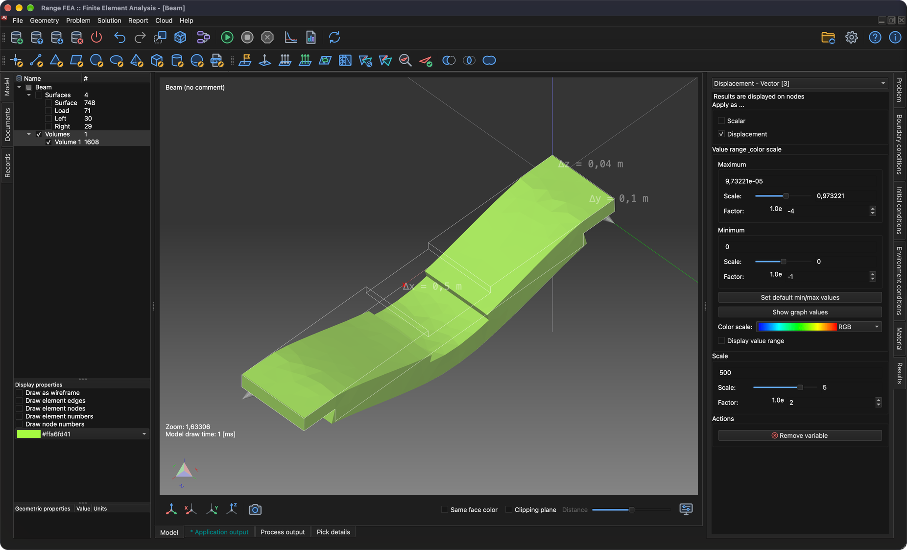

### 7.2. Von Mises Stress

Similarly as **Displacement** apply **Von Mises Stress** on selected **Volume** model entity. Additionally select **Display value range** check-box to display value range in 3D area.

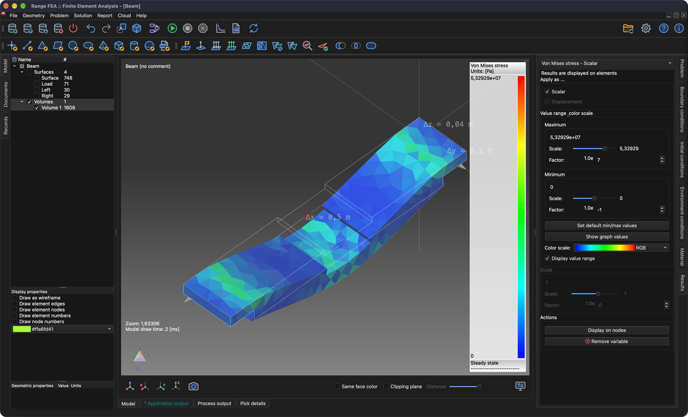

## 8. Produce report

Sometimes it is necessary to produce a report to publish computed results.

**Menu:** _Report -> Create report_

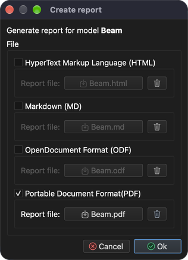

Software can produce reports in multiple formats (HTML, Markdown, ODF and PDF), all of them are checked by default. This time it is enough to produce only **PDF** document, so uncheck all formats except **Portable Document Format(PDF)** and click **Ok** button.

Once the report is generated, a message **Documents have been generated.** will be shown. Click **OK** to close it.

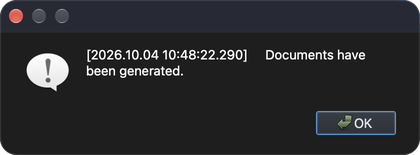

Generated documents are not displayed automatically. To do so navigate to **Documents** tree and double click on the document you would like to view.

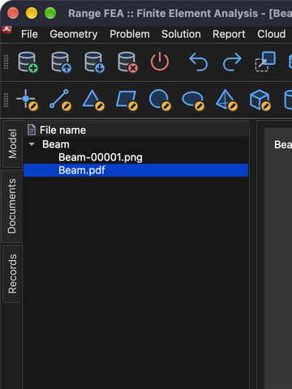

