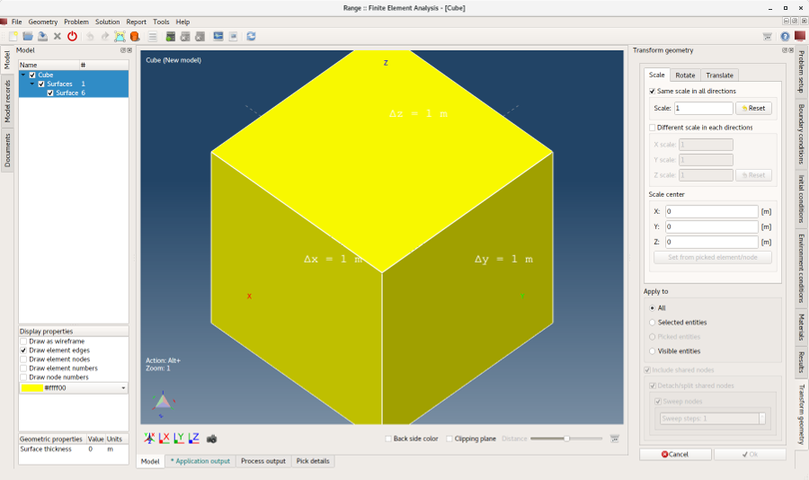
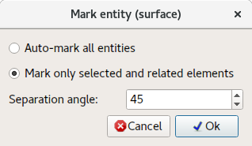
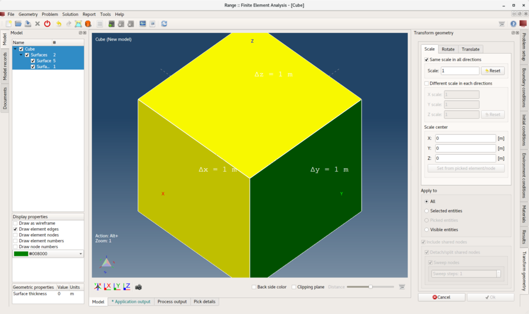
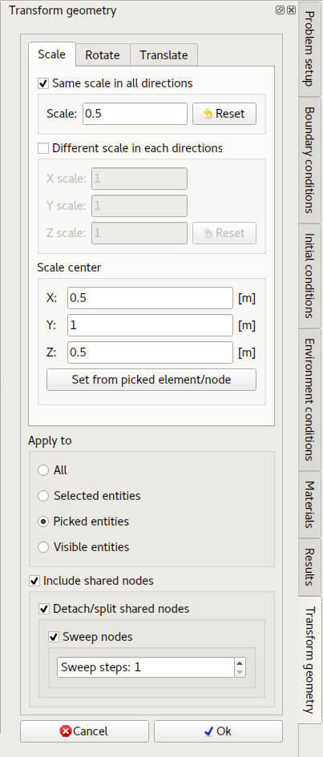
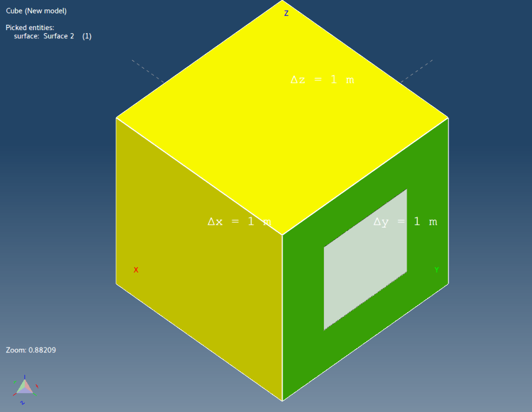
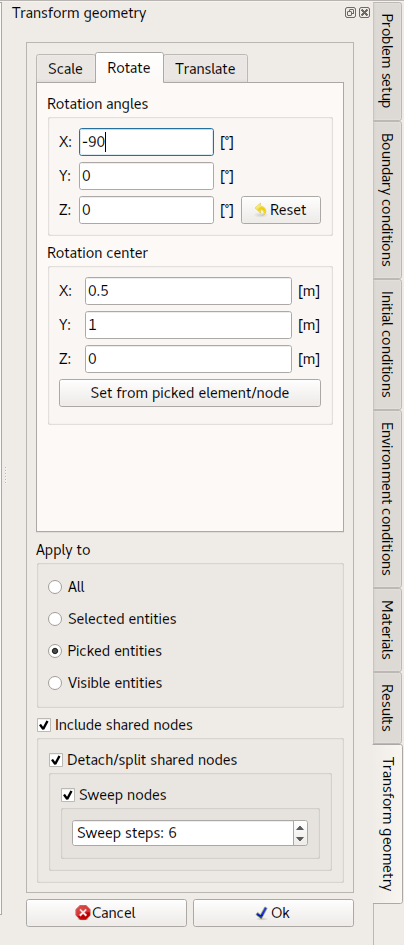
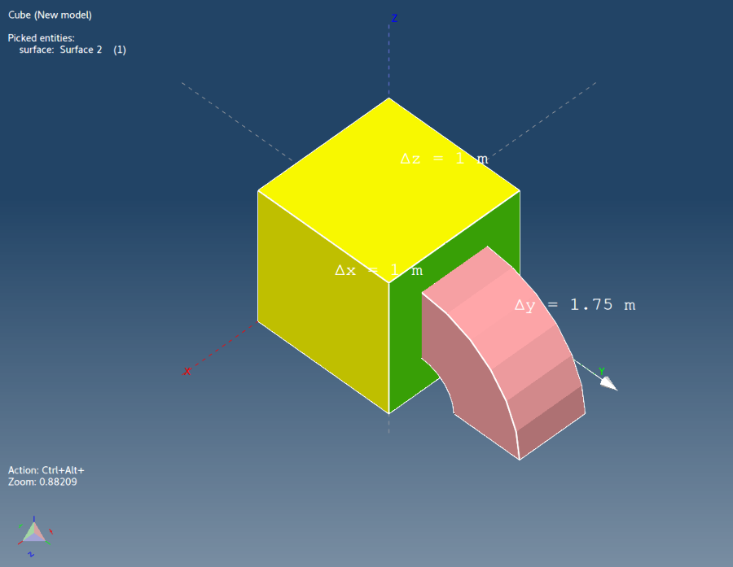

# Transform geometry

This tutorial is a sequel to the **Draw cube** tutorial and will demonstrate how to scale, rotate and translate whole geometry or only its parts.

## 1. Load model

If **Cube** model is not already loaded it can be don so with **_Open Model_** menu action.

**Menu:** _File -> Open Model_

This will show and **Open model** dialog. Select file **Cube.rbm** and click **Open**

Once model is ready its geometry (whole or part) can be modified (transformed).

## 2. Preparation

**Menu:** _Geometry -> Scale, translate, rotate_

Once menu item is activated a **Transform geometry** control will be shown on the right side of the main window where with three tabs **Scale**, **Rotate** and **Translate**.

In this tutorial all transformations will be applied consecutively on one side of the cube.

At this moment all sides of the **Cube** model are grouped in the same **surface entity**. Therefore, one side needs to be **marked** as separate **surface entity** so the transformations can be applied only on this side and not on the others. This can be done with menu action **_Mark Surface_**. But first cube side needs to be picked.

## 3. Pick a side

Press and hold **_Ctrl_** key and click with **_Left mouse button_** on one side of the cube. This will highlight the picked element. Since the **Cube** model consist of 6 rectangular (Quadrilateral) elements, then one element corresponds to one side of the **Cube**.

## 4. Mark a surface

**Menu:** _Geometry -> Surface -> Mark surface_

This action will show **Mark entity (surface)** dialog. Because in previous step one element was **picked** an option **_Mark only selected and related elements_** is preselected. By clicking **Ok** button one side of the **Cube** model will be marked as a separate **Surface entity**.

_**Note:** Any entity can be renamed by **double-clicking** with **Left mouse button** on entity name in the **Model tree** on the left side of the main window._

## 5. Scale picked entity (cube side)

Pick marked surface and open **Transform geometry** control widget.

**Menu:** _Geometry -> Scale, translate, rotate_

1. Check **Same scale in all directions**
2. Set **Scale** value to 0.5.
3. Click on **Select from picked element/node** button.
4. In **Apply to** group select **Picked entities**.
5. Make sure **Include shared nodes** is checked as well as its **all** child check-boxes.

Proper setup can be seen on following screen-shot.

Click **Ok**. Result can be seen on following screen-shot.

## 6. Rotate picked entity (scaled cube side)

By rotating picked surface an extrudes surface can be created. Open **Transform geometry** control widget.

**Menu:** _Geometry -> Surface -> Mark surface_

Specify values as shown in following screenshot.

_Note: **Sweep steps: 6** will result in six new segments._

Click **Ok**. Result can be seen on following screen-shot.

