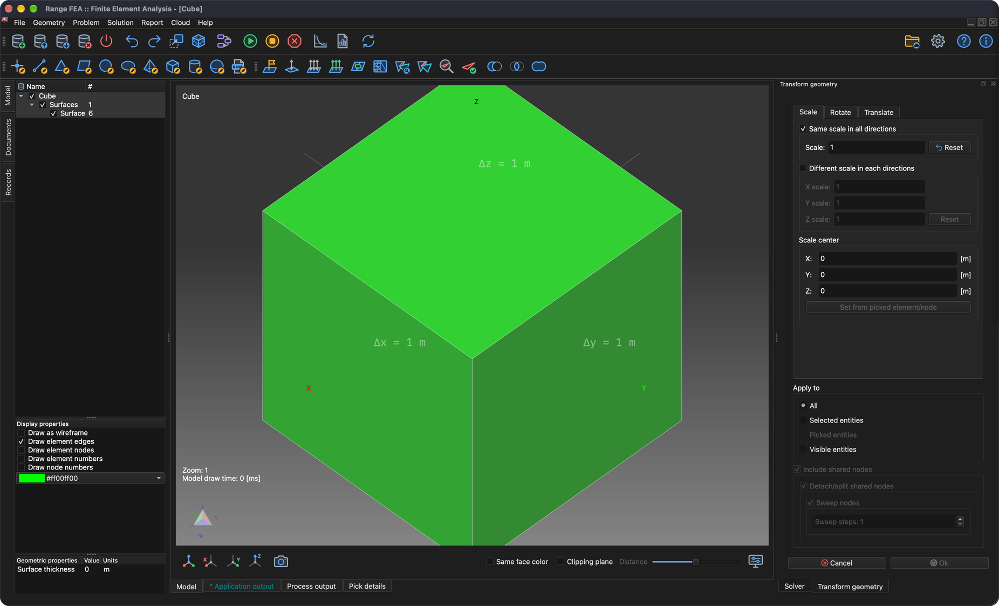
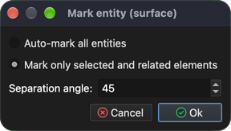
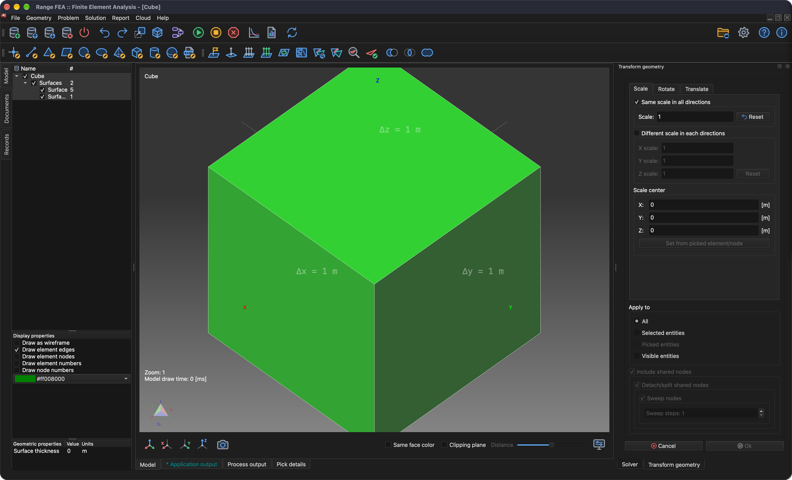
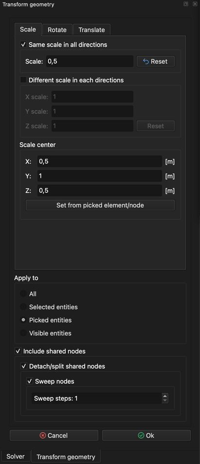
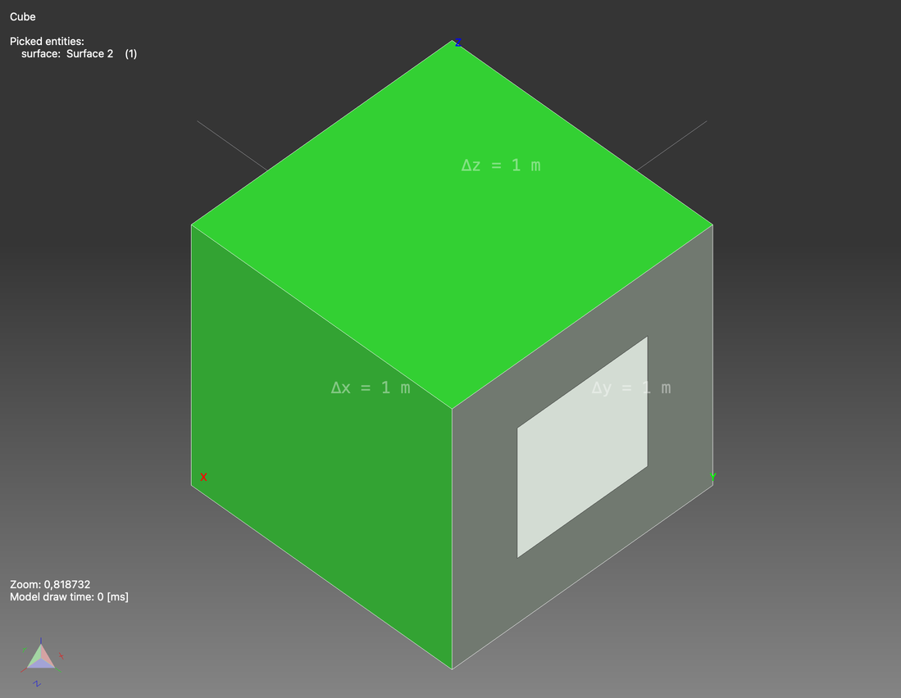
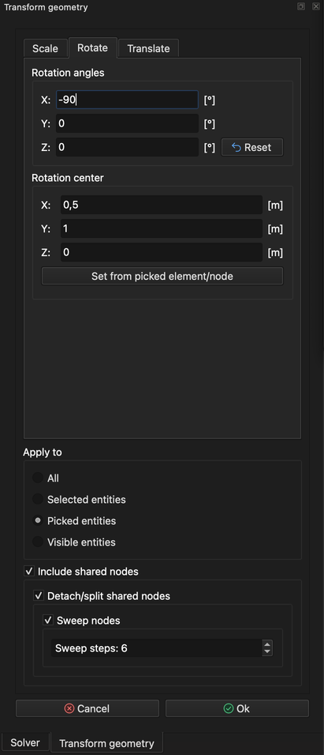
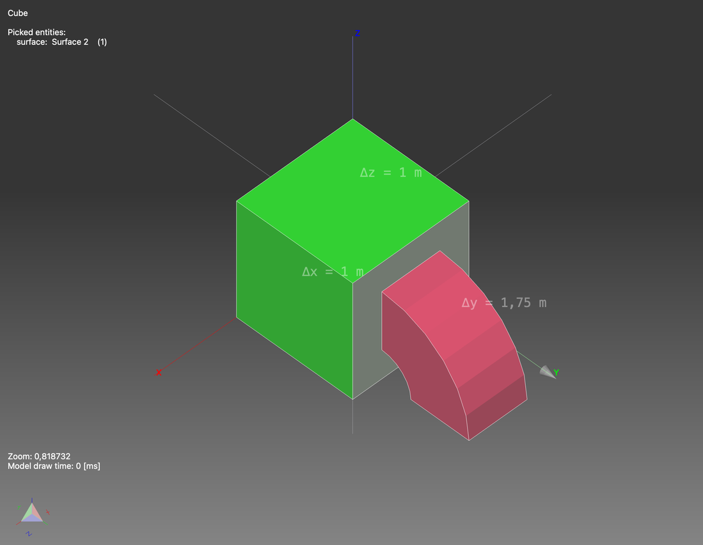

# Transform geometry

This tutorial is a sequel to the **Draw cube** tutorial and will demonstrate how to scale, rotate and translate whole geometry or only its parts.

## 1. Load model

If the **Cube** model is not already loaded, it can be done so with the **_Open model_** menu action.

**Menu:** _File -> Open model_

This will show an **Open model** dialog. Select file **Cube.rbm** and click **Open**.

Once model is ready its geometry (whole or part) can be modified (transformed).

## 2. Preparation

**Menu:** _Geometry -> Scale, translate, rotate_

Once the menu item is activated, a **Transform geometry** panel will be shown on the right side of the main window with three tabs: **Scale**, **Rotate**, and **Translate**.

In this tutorial all transformations will be applied consecutively on one side of the cube.

At this moment all sides of the **Cube** model are grouped in the same **surface entity**. Therefore, one side needs to be **marked** as a separate **surface entity** so the transformations can be applied only to this side and not to the others. This can be done with the menu action **_Mark surface_**. But first, the cube side needs to be picked.

## 3. Pick a side

Press and hold the **_Ctrl_** key (**_⌘ Cmd_** on macOS) and click with the **_Left mouse button_** on one side of the cube. This will highlight the picked element. Since the **Cube** model consists of 6 rectangular (Quadrilateral) elements, one element corresponds to one side of the **Cube**.

## 4. Mark a surface

**Menu:** _Geometry -> Surface -> Mark surface_

This action will show the **Mark entity (surface)** dialog. Because in the previous step one element was **picked**, the option **_Mark only selected and related elements_** is preselected. By clicking the **Ok** button, one side of the **Cube** model will be marked as a separate **Surface entity**.

_**Note:** Any entity can be renamed by **double-clicking** with **Left mouse button** on entity name in the **Model tree** on the left side of the main window._

## 5. Scale picked entity (cube side)

Pick the marked surface (**_Ctrl_** / **_⌘ Cmd_** + **_Left mouse button_**) and open the **Transform geometry** panel.

**Menu:** _Geometry -> Scale, translate, rotate_

1. Check **Same scale in all directions**
2. Set **Scale** value to 0.5 (use the decimal separator of your system, e.g. 0,5).
3. Click on **Set from picked element/node** button.
4. In **Apply to** group select **Picked entities**.
5. Make sure **Include shared nodes** is checked as well as its **all** child check-boxes.

Proper setup can be seen in the following screenshot.

Click **Ok**. The result can be seen in the following screenshot.

## 6. Rotate picked entity (scaled cube side)

By rotating the picked surface, an extruded surface can be created. Open the **Transform geometry** panel.

**Menu:** _Geometry -> Scale, translate, rotate_

Switch to the **Rotate** tab and specify values as shown in the following screenshot:

1. Set **Rotation angles** **X** to -90.
2. Click on **Set from picked element/node** button and then change the **Rotation center** **Z** to 0.
3. In **Apply to** group select **Picked entities**.
4. Make sure **Include shared nodes**, **Detach/split shared nodes** and **Sweep nodes** are checked and set **Sweep steps** to 6.

_Note: **Sweep steps: 6** will result in six new segments._

Click **Ok**. The result can be seen in the following screenshot.

