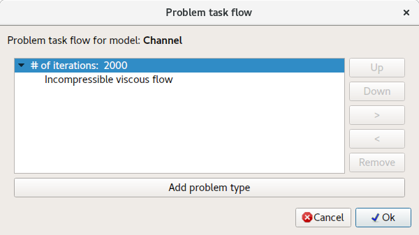
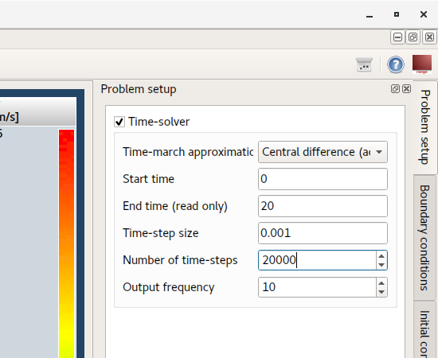
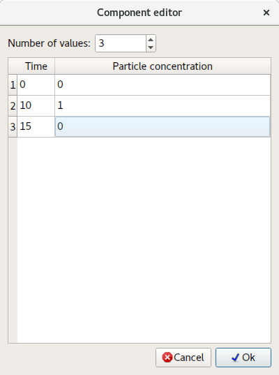
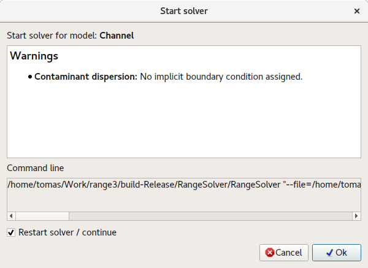

# Rozptyl kontaminantu v tekutinách

Tento tutoriál demonštruje, ako nastaviť pokročilú multifyzikálnu simuláciu vrátane nelineárneho iteratívneho problému, ako je **CFD (výpočtová dynamika tekutín)**.

Na vyriešenie **rozptylu kontaminantu v tekutine** je potrebné nakonfigurovať nasledujúce typy problémov:

1. **Rozptyl kontaminantu** – Výpočet rozloženia kontaminantu v prúdovom poli.
2. **Nestlačiteľné viskózne prúdenie** – Ustálené a prechodové prúdenie newtonských tekutín.

Keďže **CFD** je nelineárny problém, vyžaduje iteratívne riešenie. Tento problém bude vyriešený v dvoch krokoch:

1. **Ustálený stav** – Najprv je potrebné získať „počiatočné" prúdové pole a rozloženie tlaku.
2. **Prechodový stav** – V druhom kroku sa použije **časové krokovanie** na získanie prechodového riešenia.

## 1. Načítať model

Načítajte model **Channel.tmsh**.

## 2. Postup riešenia problému (krok 1)

Najprv je potrebné konvergované počiatočné prúdenie. Z tohto dôvodu je potrebné ustálené riešenie nestlačiteľného viskózneho prúdenia. V dialógu **Postup riešenia problému** vyberte príslušný typ problému a nastavte **Počet iterácií:** na **2000**. Na to dvakrát kliknite na počiatočnú hodnotu.

## 3. Vygenerovať 3D sieť

Na vyriešenie tohto problému musí byť vygenerovaná objemová sieť.

**Menu:** _Geometria -> Objem -> Generovať tetraedrálnu sieť_

## 4. Priradiť materiál

Priraďte **Vodu** všetkým entitám modelu.

## 5. Okrajové podmienky

Priraďte nasledujúce okrajové podmienky k **plošným** entitám podľa nasledujúceho opisu.

1. **Steny**
    - _Stena_
        - N/A
2. **Prítok**
    - _Objemový prietok (prítok)_
        - Objemový prietok = 50 `[m^3/sN/A]`
3. **Odtok**
    - _Tlak (implicitný)_
        - Tlak = 0 `[Pa]`

## 6. Vyriešiť problém

Postupujte rovnako ako v predchádzajúcich tutoriáloch.

Riešič bude chvíľu počítať všetky iterácie, kým nenájde konvergované riešenie. Konvergenciu riešiča možno skontrolovať pomocou nasledujúcej akcie:

**Menu:** _Správa -> Konvergencia riešiča_

## 7. Postup riešenia problému (krok 2)

Po konvergencii riešiča možno nakonfigurovať **prechodový** problém vrátane **Rozptylu kontaminantu**.

Keďže **Nestlačiteľné viskózne prúdenie** je nelineárny problém, vždy bude potrebovať určitý počet nelineárnych iterácií na nájdenie konvergovaného riešenia pre každý časový krok. **Postup riešenia** by mal vyzerať tak, ako je zobrazené na nasledujúcej snímke obrazovky.

## 8. Nastavenie časového riešiča

Kliknite na záložku **Nastavenie problému**. Povoľte **Časový riešič** a zadajte hodnoty podľa nasledujúcej snímky obrazovky.

## 9. Okrajové podmienky

Aplikujte okrajovú podmienku **Koncentrácia častíc** na entitu modelu **Prítok**.

Nezadávajte hodnotu, ale kliknite na tlačidlo **Upraviť časovo závislé hodnoty** na zadanie časovo spustenej (časový profil) okrajovej podmienky.

V dialógu **Editor komponentov** možno zadávať časovo závislé hodnoty. Hodnoty sú vždy platné **od** zadaného času.

## 10. Vyriešiť problém (reštart)

Po úplnej konfigurácii problému reštartujte riešič. Postup je rovnaký ako pri spustení riešiča, ale musí byť vybraté políčko **Reštartovať riešič / pokračovať**. Tým riešič použije už vypočítané výsledky ako východiskový bod a bude pokračovať v simulácii s časovým krokovaním.

## 11. Záznamy modelu (výsledky v čase)

Keď riešič nachádza riešenia pre každý časový krok, zapisujú sa záznamy modelu. Každý záznam obsahuje riešenie pre daný časový krok. Zoznam týchto záznamov je zobrazený v strome **Záznamy modelu**. Dvojitým kliknutím na záznam sa načítajú výsledky pre daný časový krok.

## 12. Nahrať video

Na nahranie videa z vypočítaných výsledkov prejdite do stromu **Záznamy modelu** a kliknite na tlačidlo **Nahrať** (červená bodka v dolnej časti).

Po kliknutí na tlačidlo **Nahrať** sa zobrazí dialóg **Nastavenia videa**. Kliknite na **Ok** na spustenie procesu nahrávania videa.

Vytvorenie videa môže chvíľu trvať, pretože snímky videa sa vytvárajú zo snímok obrazovky **oblasti 3D modelu** a pre každý záznam modelu musí byť načítaný.

Všetky vytvorené snímky obrazovky aj samotné video možno nájsť v strome **Dokumenty**. Na prehranie videa naň dvojito kliknite na jeho názov **Channel.avi**.

