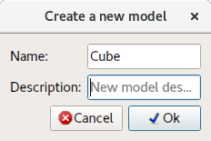
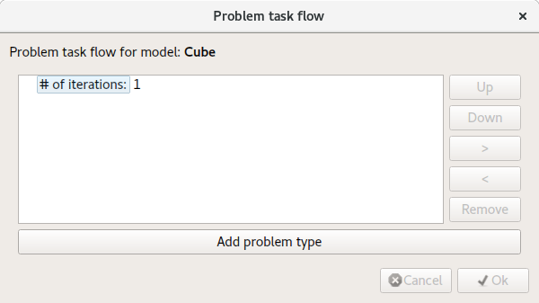
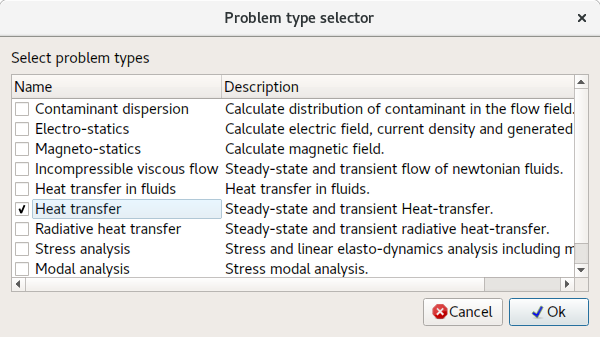
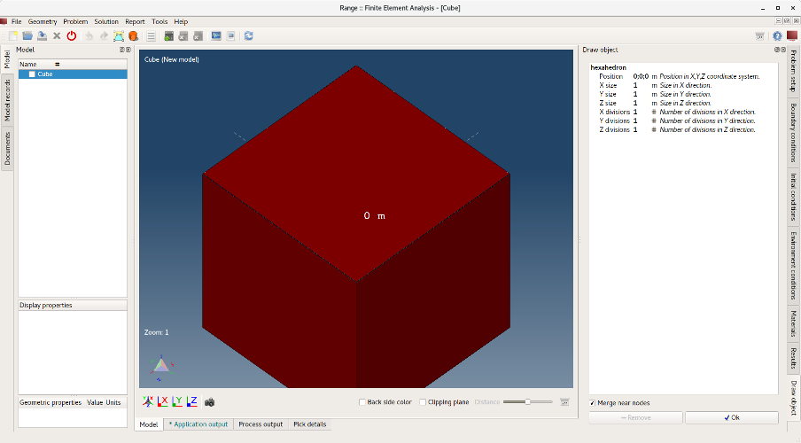

# Draw cube

This tutorial will show how to draw/generate a simple geometry such as cube.

## 1. Create a new model

**Menu:** _File -> New Model_

By clicking **Ok** a new empty model named **Cube** will be created. Since it is newly created model has no problem assigned a **Problem task flow** dialog will pop-up.

### 1.1 Assign problem type

To assign a problem type click on **Add problem type** button and in **Problem type selector** dialog select **Heat transfer**.

Click **Ok** button to close **Problem type selector** dialog to and again **Ok** button to close **Problem task flow** dialog.

## 2. Draw a cube

**Menu:** _Geometry -> Draw -> Draw hexahedron_

Once menu item is activated a **Draw objects** control will be shown on the right side of the main window where user can change object position, size and axial divisions.

Displayed object changes at the same time as values are being changed in the **Draw objects** control. By clicking on the **Ok** button object will be added to the current model.</b>

## Save model

To save model just execute following action.

**Menu:** _File -> Save Model_

If model has not been saved before, program will show **Save model** dialog offering a filename and path were to store. Click **Save** to accept.
