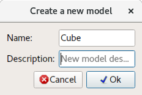
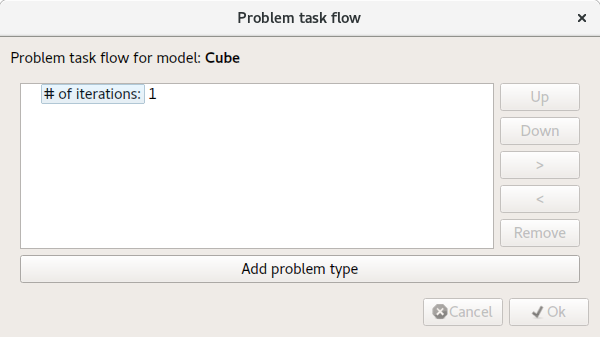
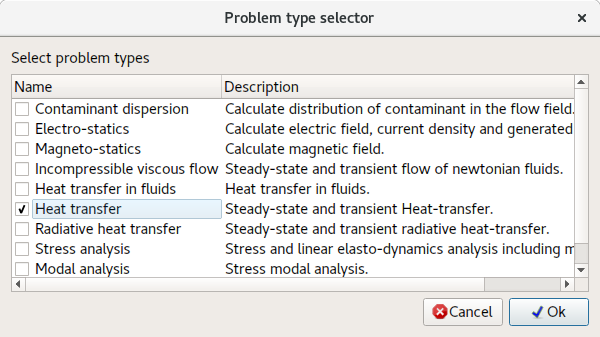
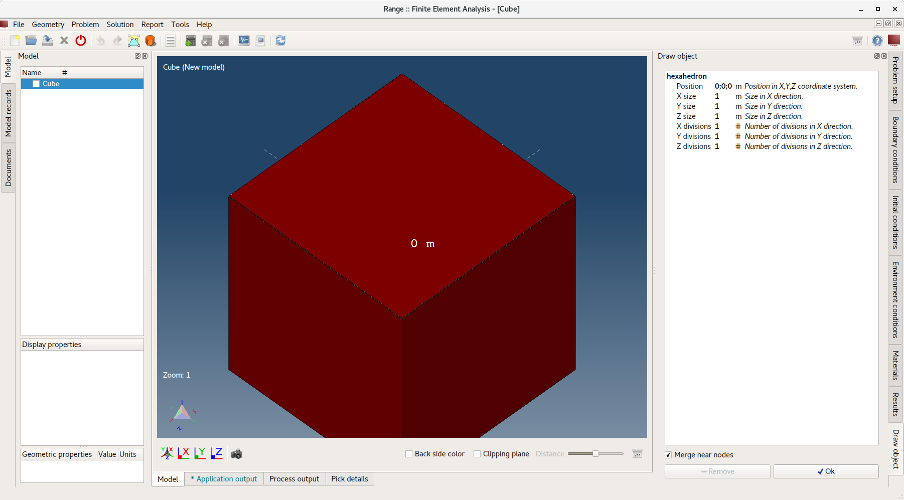

# Kresliť kocku

Tento tutoriál ukáže, ako nakresliť/vygenerovať jednoduchú geometriu, napríklad kocku.

## 1. Vytvoriť nový model

**Menu:** _Súbor -> Nový model_

Kliknutím na **Ok** sa vytvorí nový prázdny model s názvom **Kocka**. Keďže ide o novo vytvorený model bez priradeného problému, zobrazí sa dialóg **Postup riešenia problému**.

### 1.1 Priradiť typ problému

Ak chcete priradiť typ problému, kliknite na tlačidlo **Pridať typ problému** a v dialógu **Výber typu problému** vyberte **Prestup tepla**.

Kliknite na tlačidlo **Ok** na zatvorenie dialógu **Výber typu problému** a opäť na **Ok** na zatvorenie dialógu **Postup riešenia problému**.

## 2. Nakresliť kocku

**Menu:** _Geometria -> Kresliť -> Kresliť hexaeder_

Po aktivácii položky menu sa na pravej strane hlavného okna zobrazí ovládací prvok **Kresliť objekty**, v ktorom môže používateľ zmeniť polohu, veľkosť a osové delenie objektu.

Zobrazený objekt sa mení súčasne so zmenami hodnôt v ovládacom prvku **Kresliť objekty**. Kliknutím na tlačidlo **Ok** sa objekt pridá do aktuálneho modelu.

## Uložiť model

Na uloženie modelu vykonajte nasledujúcu akciu.

**Menu:** _Súbor -> Uložiť model_

Ak model ešte nebol uložený, program zobrazí dialóg **Uložiť model** s ponukou názvu súboru a cesty na uloženie. Kliknite na **Uložiť** na potvrdenie.
