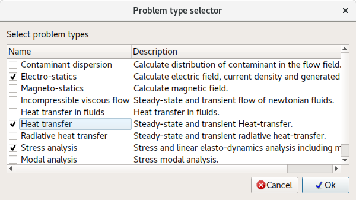
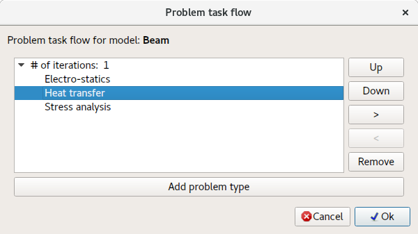
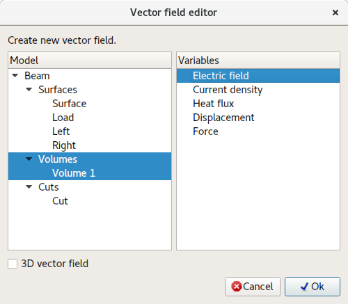
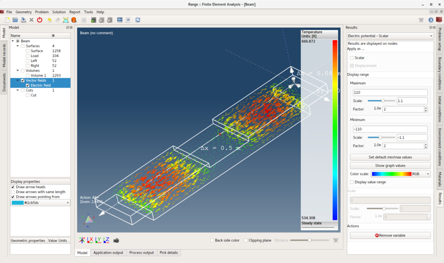
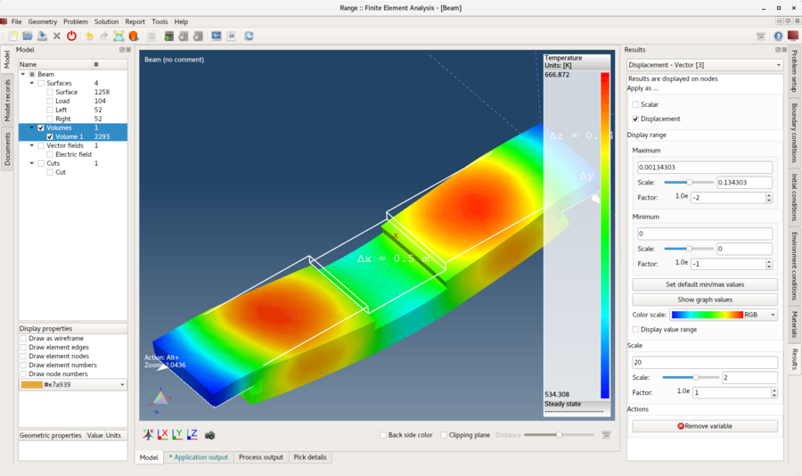

# Multifyzika

Tento tutoriál sa zaoberá riešením viacerých problémov na jednom geometrickom modeli. Na tento účel bude použitý **model nosníka**, cez ktorý prechádzajúci elektrický prúd vygeneruje teplo a deformuje model.

Takýto inžiniersky problém si bude vyžadovať nastavenie troch typov problémov:

1. **Elektrostatika** – Výpočet elektrického prúdu a generovaného tepla.
2. **Prestup tepla** – Výpočet rozloženia teploty.
3. **Analýza napätia** – Výpočet tepelnej rozťažnosti (posunutí) a výsledného napätia.

## 1. Načítať model

Postupujte rovnako ako v predchádzajúcom tutoriáli **Analýza napätia a deformácie**.

## 2. Postup riešenia problému

Jediný rozdiel oproti procesu opísanému v predchádzajúcom tutoriáli spočíva v ukážke, ako vytvoriť **Postup riešenia problému**. Všetko ostatné sa vykonáva rovnakým spôsobom.

**Menu:** _Problém -> Postup riešenia problémov_

Vo **Výbere typu problému** vyberte všetky tri typy problémov a kliknite na **Ok**.

Váš **Postup riešenia problému** by teraz mal vyzerať ako na nasledujúcom obrázku. Ak poradie nie je rovnaké alebo ak sú tam ďalšie záznamy, možno použiť tlačidlá **Hore**, **Dole** a **Odstrániť** na úpravu postupu.

## 3. Priradiť materiál

Postupujte rovnako ako v predchádzajúcom tutoriáli **Analýza napätia a deformácie**.

## 4. Priradiť okrajové podmienky

Keďže je vybratých viacero typov problémov, každej entite možno priradiť viacero okrajových podmienok. Priraďte okrajové podmienky k **plošným** entitám podľa nasledujúceho opisu.

1. **Plocha**
    - _Jednoduchá konvekcia_
        - Koeficient konvekcie = 100 `[W/(m^2*K)]`
        - Teplota = 293,15 `[K]`
2. **Zaťaženie**
    - _Elektrický potenciál_
        - Elektrický potenciál = 110 `[V]`
    - _Jednoduchá konvekcia_
        - Koeficient konvekcie = 100 `[W/(m^2*K)]`
        - Teplota = 293,15 `K`
3. **Ľavá** a **Pravá**
    - _Posunutie_
        - Posunutie vo všetkých smeroch = 0 `[m]`
    - _Elektrický potenciál_
        - Elektrický potenciál = -110 `[V]`
    - _Jednoduchá konvekcia_
        - Koeficient konvekcie = 100 `[W/(m^2*K)]`
        - Teplota = 293,15 `K`

## 5. Priradiť podmienky prostredia

Priraďte nasledujúce podmienky prostredia **všetkým** entitám modelu.

- _Gravitačné zrýchlenie_
    - Gravitačné zrýchlenie v smere X = 0 `[m/s^2]`
    - Gravitačné zrýchlenie v smere Y = 0 `[m/s^2]`
    - Gravitačné zrýchlenie v smere Z = -9,80665 `[m/s^2]`
- _Teplota_
    - Teplota = 293,15 `[K]`

## 6. Vyriešiť problém

Postupujte rovnako ako v predchádzajúcom tutoriáli **Analýza napätia a deformácie**.

## 7. Vytvoriť vektorové pole

**Vektorové pole** je entita, ktorá sa použije na vizualizáciu elektrického poľa.

**Menu:** _Geometria -> Vektorové pole -> Vytvoriť vektorové pole_

Vyberte entitu **objem** modelu a **Elektrické pole** podľa nasledujúceho obrázka.

Kliknite na tlačidlo **Ok** na vytvorenie **Vektorového poľa**. Po vytvorení bude pridané do **Stromu modelu** a možno naň aplikovať výsledkové premenné rovnako ako na akúkoľvek inú entitu modelu.

## 8. Aplikovať výsledky

Postupujte rovnako ako v predchádzajúcom tutoriáli **Analýza napätia a deformácie**. Výsledky môžete navyše aplikovať aj na vytvorenú entitu **Vektorové pole**.

