# Stress and deformation analysis

This tutorial will demonstrate how to setup and solve **Stress analysis** problem. For that reason a simple beam will be supported on both ends with load in the middle.

## 1. Load model

**Menu:** _File -> Open Model_

This will show and **Open model** dialog. Select file **Beam.tmsh** and click **Open** to load model.

Since there is no physical problem assigned to this model a **Problem task flow** dialog window will appear soon after loading of the model is complete.

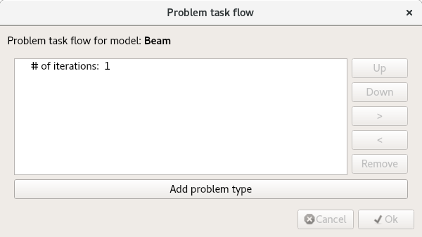

Click **Add problem type** button and **Problem type selector** dialog window will be displayed. Find and check **Stress analysis** and click **Ok** button to accept.

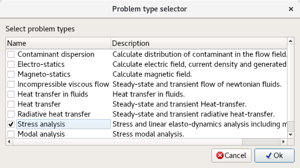

**Problem task flow** should now display 1 iteration of **Stress analysis**. Click **Ok** to accept.

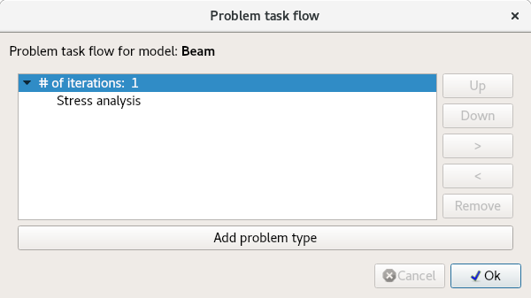

## 2. Generate 3D mesh

To solve this problem volume mesh must be generated.

**Menu:** _Geometry -> Volume -> Generate tetrahedral mesh_

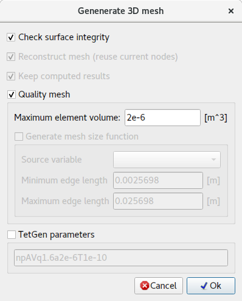

For now prefilled values are sufficient. Click **Ok** button to accept.

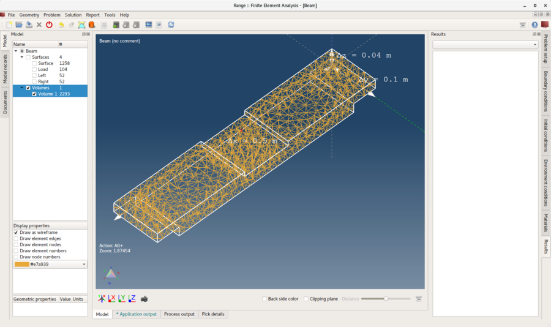

## 3. Assign material

Material can be assigned only to selected model entity. Entities can be selected in the **Model tree**. To select multiple entities hold-down the _Ctrl_ while selecting entities. Once all entities are selected then material can be assigned.

**Model tree** and **material list** can be seen on screenshot below.

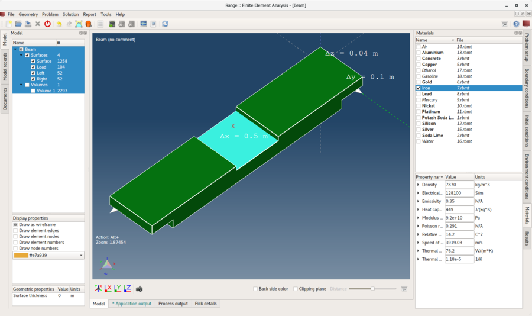

Material is assigned when check-box in front of the material name is checked.

_Note: All model entities must have material assigned._

## 4. Assign boundary conditions

The boundary conditions are the specified values of the field variables (or related variables such as derivatives) on the boundaries of the field. Boundary conditions can be divided into **Explicit** and **Implicit** conditions. **Explicit** conditions are highlighted with **strong** font.

In this tutorial boundary conditions will be applied to **surface** entities as described below:

1. **Load**
    - _Weight_
        - Weight = 1000 `[kg]`
2. **Left** and **Right**
    - _Displacement_
        - Displacement in X direction = 0 `[m]`
        - Displacement in Y direction = 0 `[m]`
        - Displacement in Z direction = 0 `[m]`

To apply **Weight** boundary condition follow these steps:

1. Select **Load** entity in the **Model tree**.
2. Select and check **Weight** boundary condition from the **Boundary conditions** list.
3. Replace **1** with **1000** `[kg]` in value field for **Weight** property.

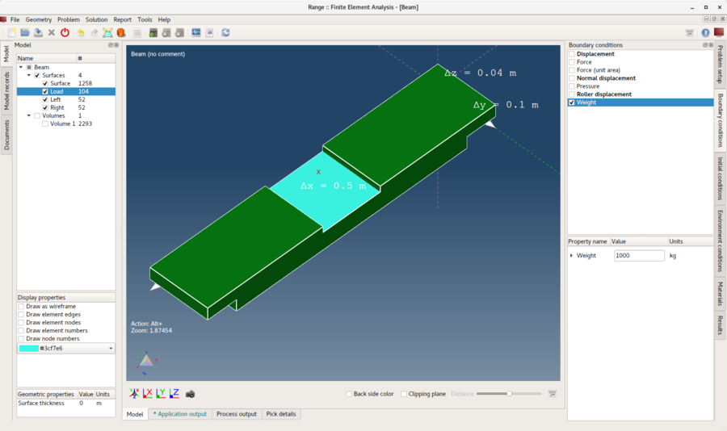

To apply **Displacement** boundary condition follow these steps:

1. Select **Left** and **Right** entities in the **Model tree**.
2. Select and check **Displacement** boundary condition from the **Boundary conditions** list.
3. Verify that all property values are set to **0** `[m]`.

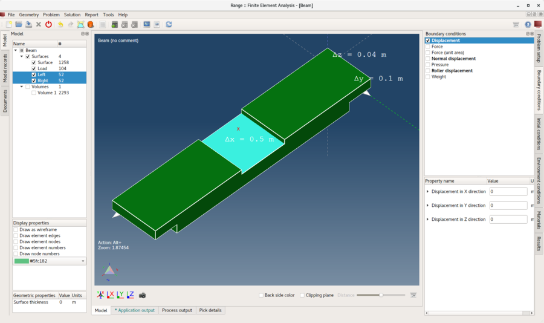

## 5. Assign environment conditions

For **Weight** boundary condition to work properly correct **Gravitational acceleration** environment condition must be assigned.

Environment conditions are assigned in the same way as boundary conditions.

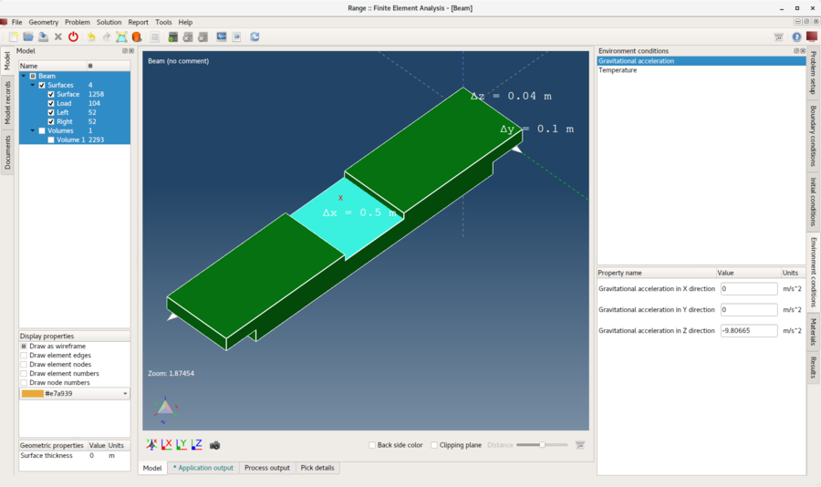

## 6. Solve problem

Once the problem is correctly configured it can be solved.

**Menu:** _Solution -> Start solver_

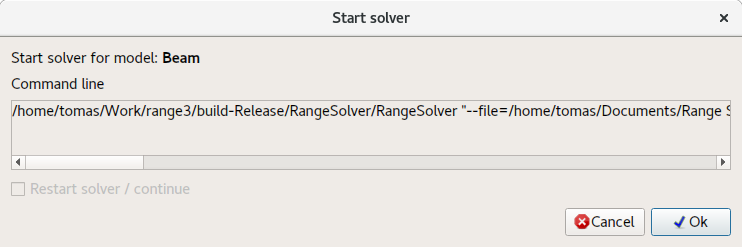

Click **Ok** button to start the solver process.

Solver process is running in the background and all its output is displayed in the **Process output** tab as it can be seen on the screenshot below.
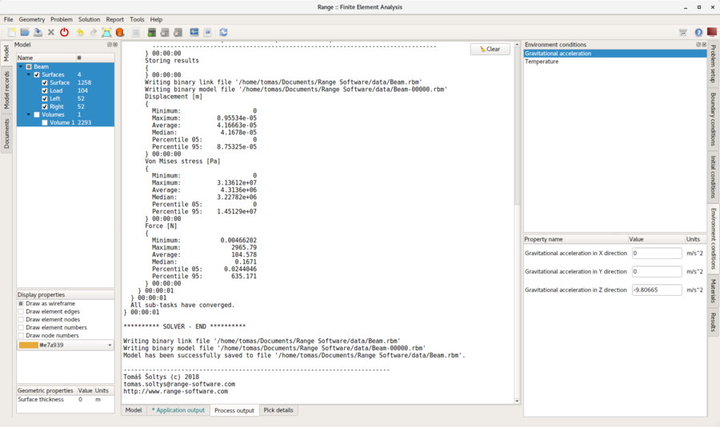

## 7. Apply computed results

After the solver process is successfully completed computed results should be loaded automatically. To display these results they need to be applied on model entities. This is done in **Results** tab control. Results are applied to the selected model entities. For this purpose hide all surface entities and show only **Volumes**.

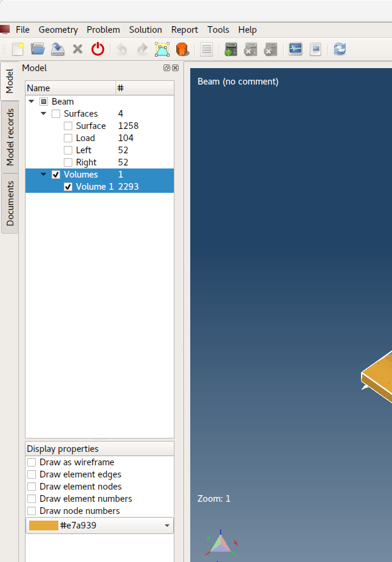

### 7.1. Displacement

From drop-down menu select **Displacement** (if not already selected). **Displacement** is a vector variable it can be applied as a **Scalar** (entity will be colored by its magnitude) and/or as a **Displacement** (entity will bend). This time select **Displacement** check-box. And set **Scale** to **500** to see the deformation.

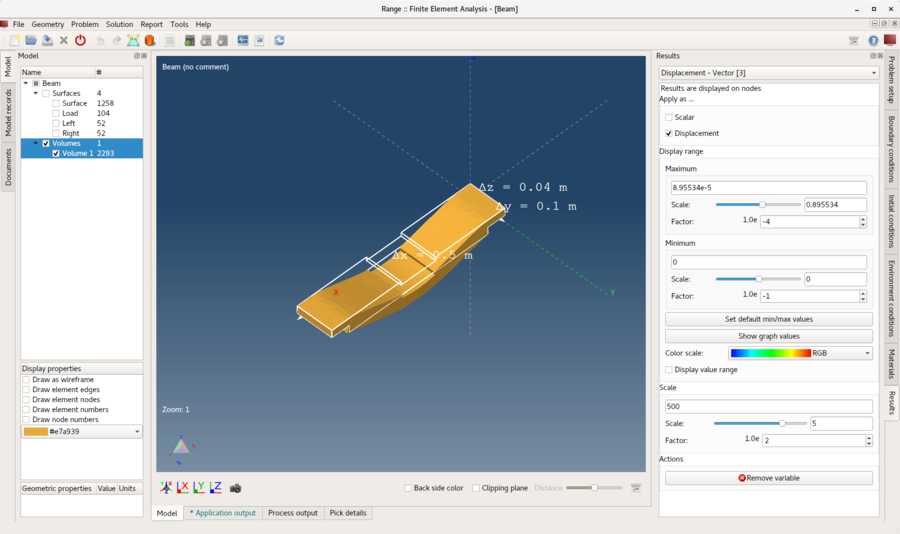

### 7.2. Von Mises Stress

Similarly as **Displacement** apply **Von Mises Stress** on selected **Volume** model entity. Additionally select **Display value range** check-box to display value range in 3D area.

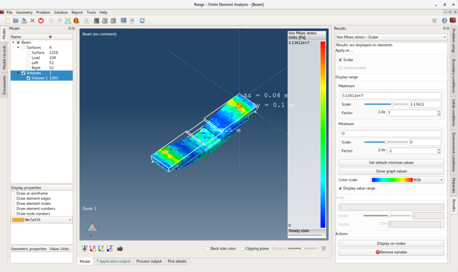

## 8. Produce report

Sometimes it is needed to produce a report to publish computed results.

**Menu:** _Report -> Create report_

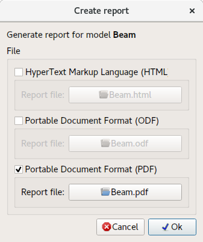

Software can produce reports in multiple formats. This time it is enough to produce only **PDF** document, so select **Portable Document Format (PDF)** check-box and click **Ok** button.

Generated documents are not displayed automatically. To do so navigate to **Documents** tree and double click on the document you would like to view.

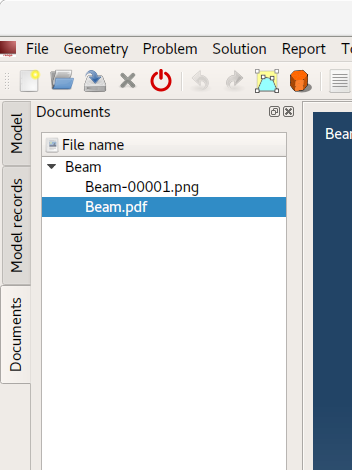

