# Analýza napätia a deformácie

Tento tutoriál demonštruje, ako nastaviť a vyriešiť problém **Analýzy napätia**. Na tento účel bude jednoduchý nosník podopretý na oboch koncoch so zaťažením v strede.

## 1. Načítať model

**Menu:** _Súbor -> Otvoriť model_

Zobrazí sa dialóg **Otvoriť model**. Vyberte súbor **Beam.tmsh** a kliknite na **Otvoriť** na načítanie modelu.

Keďže tomuto modelu nie je priradený žiadny fyzikálny problém, krátko po dokončení načítania modelu sa zobrazí dialóg **Postup riešenia problému**.

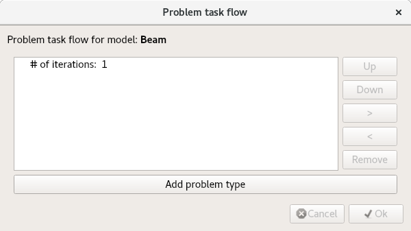

Kliknite na tlačidlo **Pridať typ problému** a zobrazí sa dialóg **Výber typu problému**. Nájdite a zaškrtnite **Analýza napätia** a kliknite na **Ok** na potvrdenie.

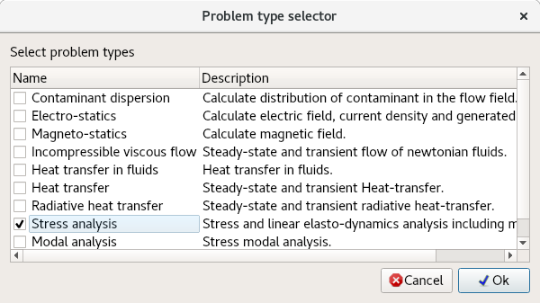

**Postup riešenia problému** by teraz mal zobrazovať 1 iteráciu **Analýzy napätia**. Kliknite na **Ok** na potvrdenie.

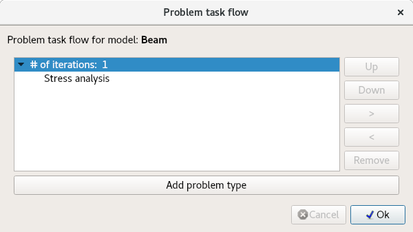

## 2. Vygenerovať 3D sieť

Na vyriešenie tohto problému musí byť vygenerovaná objemová sieť.

**Menu:** _Geometria -> Objem -> Generovať tetraedrálnu sieť_

Predvyplnené hodnoty sú zatiaľ dostačujúce. Kliknite na **Ok** na potvrdenie.

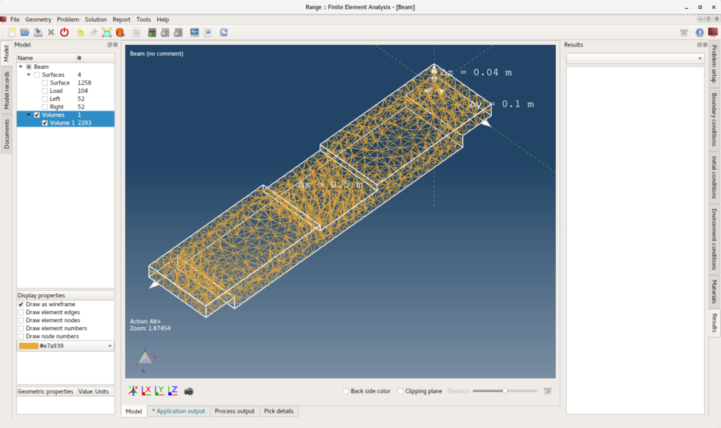

## 3. Priradiť materiál

Materiál možno priradiť iba vybratej entite modelu. Entity možno vyberať v **Strome modelu**. Na výber viacerých entít podržte kláves _Ctrl_ počas výberu entít. Po výbere všetkých entít možno priradiť materiál.

**Strom modelu** a **zoznam materiálov** sú zobrazené na nasledujúcej snímke obrazovky.

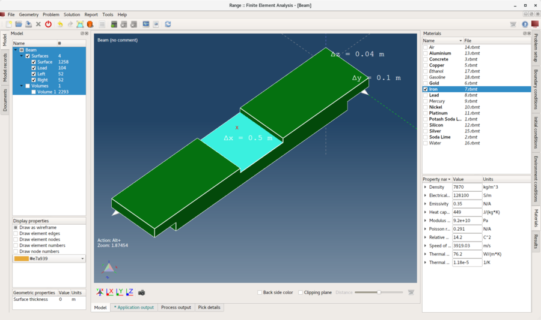

Materiál je priradený, keď je zaškrtnuté políčko pred názvom materiálu.

_Poznámka: Všetkým entitám modelu musí byť priradený materiál._

## 4. Priradiť okrajové podmienky

Okrajové podmienky sú zadané hodnoty premenných poľa (alebo súvisiacich premenných, ako sú derivácie) na hraniciach poľa. Okrajové podmienky možno rozdeliť na **Explicitné** a **Implicitné** podmienky. **Explicitné** podmienky sú zvýraznené **tučným** písmom.

V tomto tutoriáli budú okrajové podmienky aplikované na **plošné** entity podľa nasledujúceho opisu:

1. **Zaťaženie**
    - _Hmotnosť_
        - Hmotnosť = 1000 `[kg]`
2. **Ľavá** a **Pravá**
    - _Posunutie_
        - Posunutie v smere X = 0 `[m]`
        - Posunutie v smere Y = 0 `[m]`
        - Posunutie v smere Z = 0 `[m]`

Na aplikovanie okrajovej podmienky **Hmotnosť** postupujte podľa týchto krokov:

1. Vyberte entitu **Zaťaženie** v **Strome modelu**.
2. Vyberte a zaškrtnite okrajovú podmienku **Hmotnosť** v zozname **Okrajové podmienky**.
3. Nahraďte hodnotu **1** hodnotou **1000** `[kg]` v hodnotovom poli pre vlastnosť **Hmotnosť**.

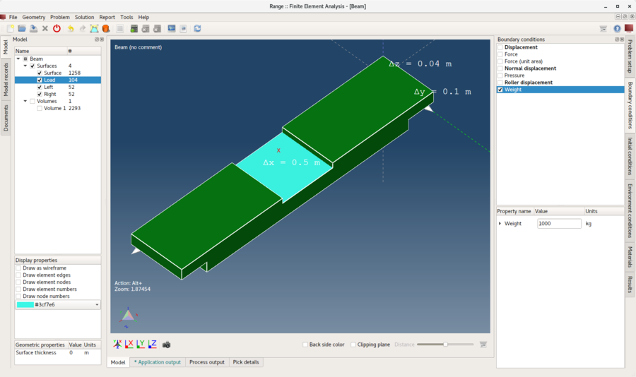

Na aplikovanie okrajovej podmienky **Posunutie** postupujte podľa týchto krokov:

1. Vyberte entity **Ľavá** a **Pravá** v **Strome modelu**.
2. Vyberte a zaškrtnite okrajovú podmienku **Posunutie** v zozname **Okrajové podmienky**.
3. Overte, že všetky hodnoty vlastností sú nastavené na **0** `[m]`.

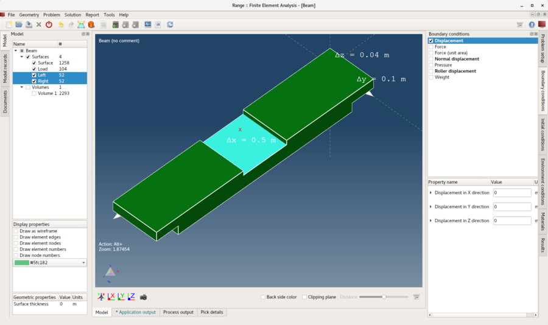

## 5. Priradiť podmienky prostredia

Aby okrajová podmienka **Hmotnosť** správne fungovala, musí byť priradená správna podmienka prostredia **Gravitačné zrýchlenie**.

Podmienky prostredia sa priraďujú rovnakým spôsobom ako okrajové podmienky.

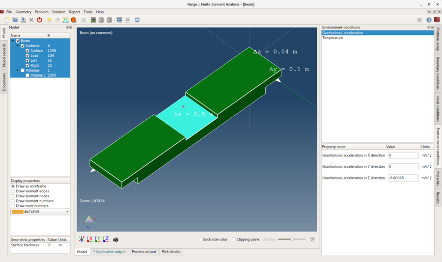

## 6. Vyriešiť problém

Keď je problém správne nakonfigurovaný, možno ho vyriešiť.

**Menu:** _Riešenie -> Spustiť riešič_

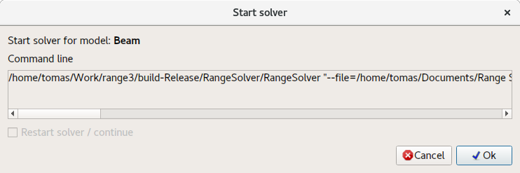

Kliknite na tlačidlo **Ok** na spustenie procesu riešiča.

Proces riešiča beží na pozadí a všetky jeho výstupy sú zobrazované v záložke **Výstup procesu**, ako je vidieť na nasledujúcej snímke obrazovky.
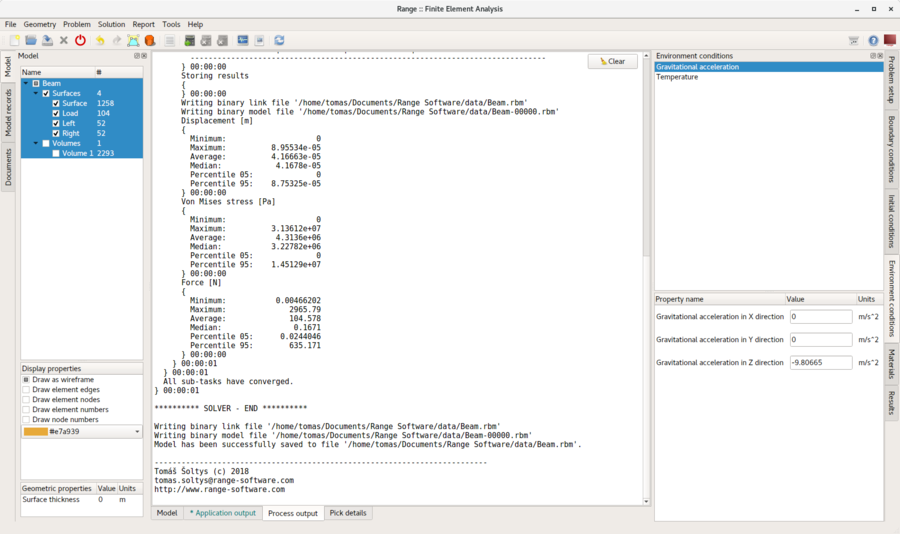

## 7. Aplikovať vypočítané výsledky

Po úspešnom dokončení procesu riešiča by sa vypočítané výsledky mali načítať automaticky. Na zobrazenie týchto výsledkov je potrebné ich aplikovať na entity modelu. To sa vykonáva v ovládacom prvku záložky **Výsledky**. Výsledky sa aplikujú na vybraté entity modelu. Na tento účel skryte všetky plošné entity a zobrazte len **Objemy**.

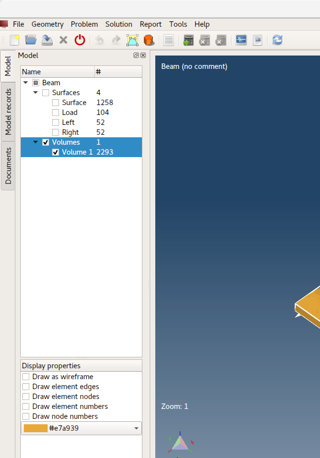

### 7.1. Posunutie

Z rozbaľovacieho menu vyberte **Posunutie** (ak ešte nie je vybrané). **Posunutie** je vektorová premenná, ktorú možno aplikovať ako **Skalár** (entita bude sfarbená podľa jej veľkosti) a/alebo ako **Posunutie** (entita sa ohne). Tentokrát zaškrtnite políčko **Posunutie**. Nastavte hodnotu **Mierka** na **500**, aby bola deformácia viditeľná.

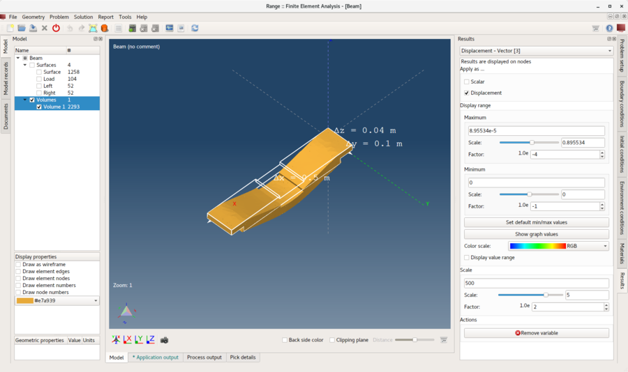

### 7.2. Von Misesovo napätie

Podobne ako **Posunutie** aplikujte **Von Misesovo napätie** na vybranú **Objemovú** entitu modelu. Ďalej zaškrtnite políčko **Zobraziť rozsah hodnôt** na zobrazenie rozsahu hodnôt v 3D oblasti.

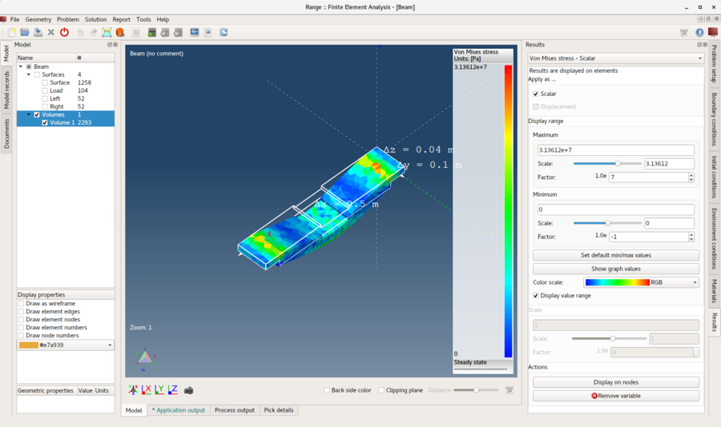

## 8. Vytvoriť správu

Niekedy je potrebné vytvoriť správu na publikovanie vypočítaných výsledkov.

**Menu:** _Správa -> Vytvoriť správu_

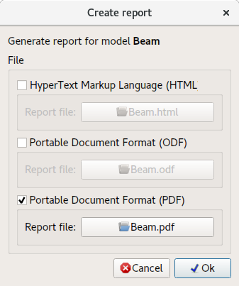

Softvér môže vytvárať správy v rôznych formátoch. Tentokrát stačí vytvoriť len dokument vo formáte **PDF**, preto zaškrtnite políčko **Portable Document Format (PDF)** a kliknite na **Ok**.

Vygenerované dokumenty sa nezobrazujú automaticky. Na ich zobrazenie prejdite do stromu **Dokumenty** a dvojitým kliknutím otvorte dokument, ktorý chcete zobraziť.

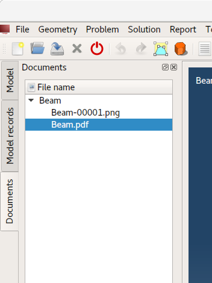
