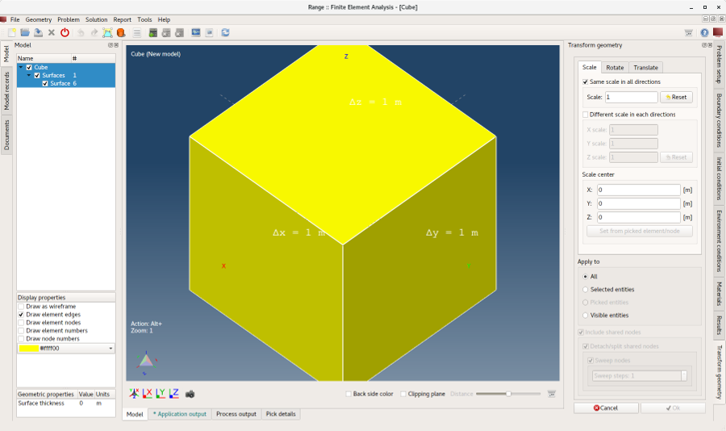
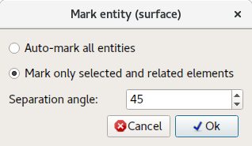
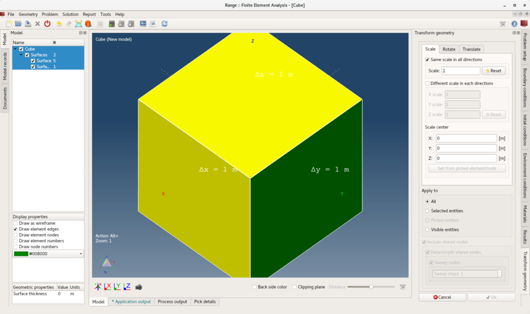
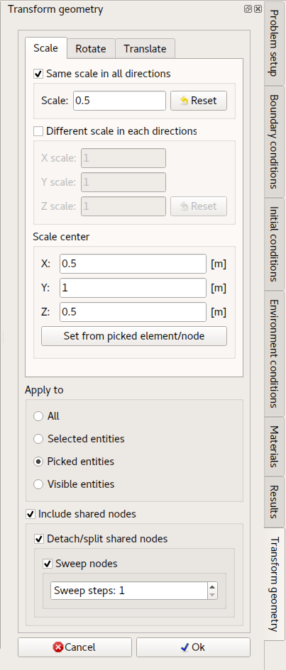
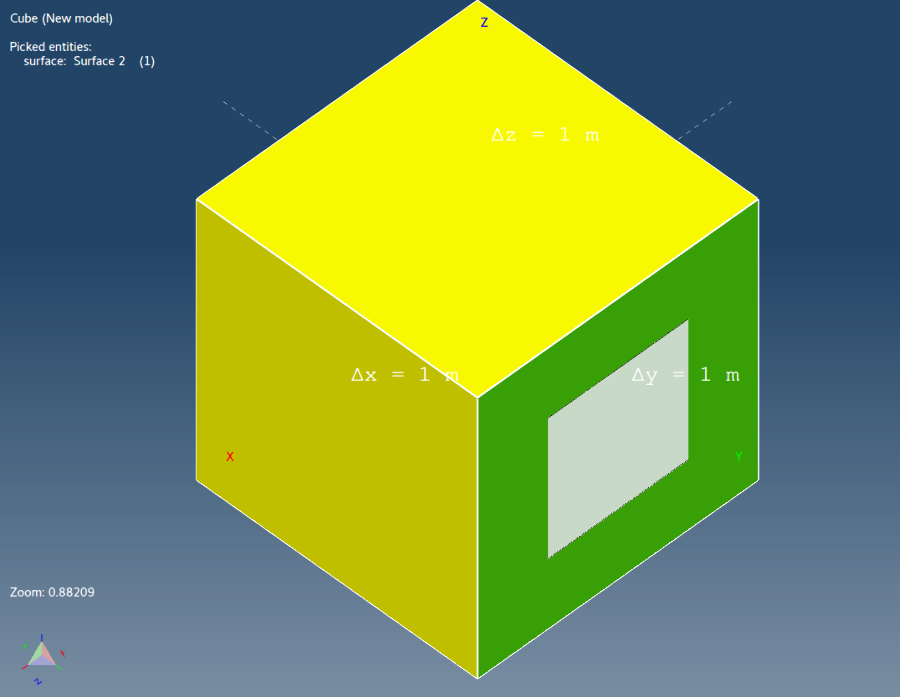
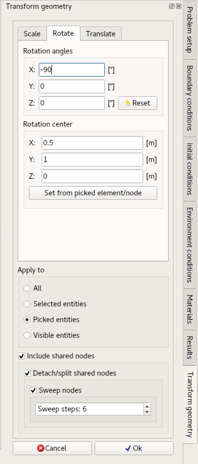
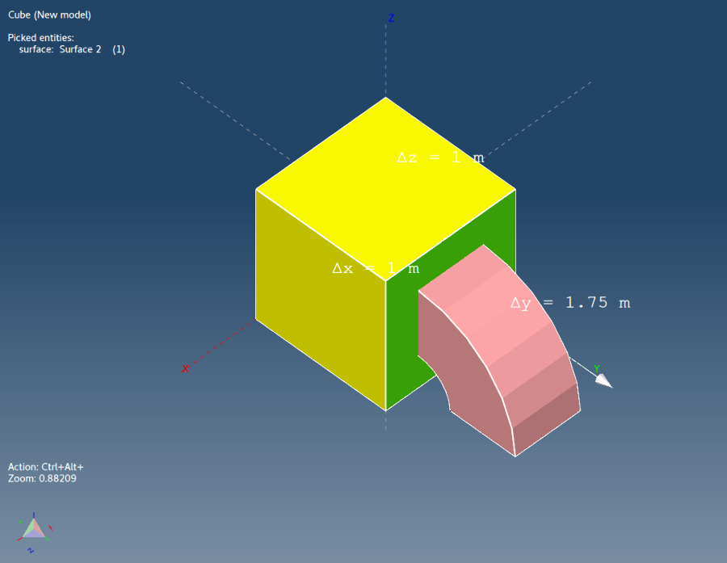

# Transformovať geometriu

Tento tutoriál nadväzuje na tutoriál **Kresliť kocku** a demonštruje, ako škálovať, otáčať a posúvať celú geometriu alebo len jej časti.

## 1. Načítať model

Ak model **Kocka** ešte nie je načítaný, možno ho otvoriť pomocou akcie menu **_Otvoriť model_**.

**Menu:** _Súbor -> Otvoriť model_

Zobrazí sa dialóg **Otvoriť model**. Vyberte súbor **Cube.rbm** a kliknite na **Otvoriť**.

Keď je model pripravený, jeho geometriu (celú alebo jej časť) možno upraviť (transformovať).

## 2. Príprava

**Menu:** _Geometria -> Škálovanie, posun, rotácia_

Po aktivácii položky menu sa na pravej strane hlavného okna zobrazí ovládací prvok **Transformovať geometriu** s troma záložkami: **Škálovanie**, **Rotácia** a **Posun**.

V tomto tutoriáli budú všetky transformácie postupne aplikované na jednu stranu kocky.

V tejto chvíli sú všetky strany modelu **Kocka** zoskupené v rovnakej **plošnej entite**. Preto je potrebné jednu stranu **označiť** ako samostatnú **plošnú entitu**, aby bolo možné aplikovať transformácie len na túto stranu a nie na ostatné. Možno to urobiť pomocou akcie menu **_Označiť plochu_**. Najprv je však potrebné vybrať stranu kocky.

## 3. Vybrať stranu

Stlačte a podržte kláves **_Ctrl_** a kliknite **_ľavým tlačidlom myši_** na jednu stranu kocky. Tým sa vybratý prvok zvýrazní. Keďže model **Kocka** pozostáva zo 6 obdĺžnikových (štvoruholníkových) prvkov, jeden prvok zodpovedá jednej strane **Kocky**.

## 4. Označiť plochu

**Menu:** _Geometria -> Plocha -> Označiť plochu_

Táto akcia zobrazí dialóg **Označiť entitu (plochu)**. Keďže v predchádzajúcom kroku bol vybratý jeden prvok, je predvolene vybraná možnosť **_Označiť iba vybrané a súvisiace prvky_**. Kliknutím na tlačidlo **Ok** bude jedna strana modelu **Kocka** označená ako samostatná **Plošná entita**.

_**Poznámka:** Akúkoľvek entitu možno premenovať **dvojitým kliknutím** **ľavým tlačidlom myši** na názov entity v **Strome modelu** na ľavej strane hlavného okna._

## 5. Škálovať vybratú entitu (stranu kocky)

Vyberte označenú plochu a otvorte ovládací prvok **Transformovať geometriu**.

**Menu:** _Geometria -> Škálovanie, posun, rotácia_

1. Zaškrtnite **Rovnaké škálovanie vo všetkých smeroch**.
2. Nastavte hodnotu **Mierka** na 0,5.
3. Kliknite na tlačidlo **Vybrať z označeného prvku/uzla**.
4. V skupine **Použiť na** vyberte **Vybraté entity**.
5. Uistite sa, že je zaškrtnutá možnosť **Zahrnúť zdieľané uzly** spolu so všetkými jej podriadeným zaškrtávacími políčkami.

Správne nastavenie je zobrazené na nasledujúcej snímke obrazovky.

Kliknite na **Ok**. Výsledok je zobrazený na nasledujúcej snímke obrazovky.

## 6. Otočiť vybratú entitu (škálovanú stranu kocky)

Otočením vybranej plochy možno vytvoriť vytiahnutú plochu. Otvorte ovládací prvok **Transformovať geometriu**.

**Menu:** _Geometria -> Plocha -> Označiť plochu_

Zadajte hodnoty podľa nasledujúcej snímky obrazovky.

_Poznámka: **Počet krokov rozmetania: 6** vytvorí šesť nových segmentov._

Kliknite na **Ok**. Výsledok je zobrazený na nasledujúcej snímke obrazovky.

